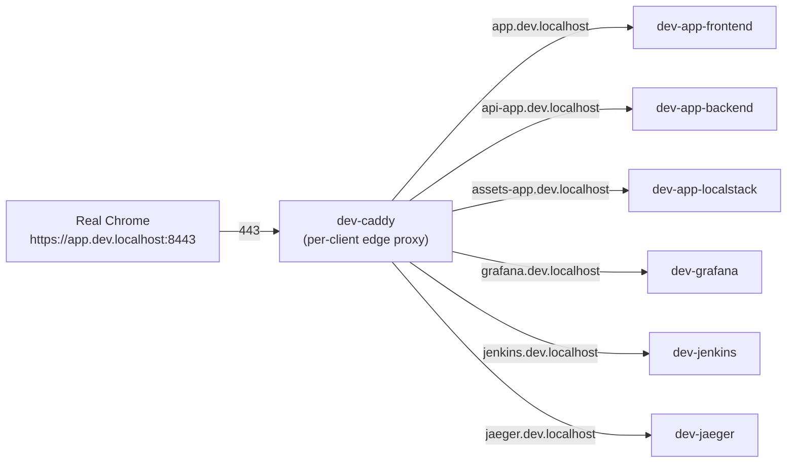

# 0001. Use a per-client Caddy proxy for browser-friendly local URLs

- **Status:** Deferred (2026-04-30) — design accepted, implementation queued behind hot-reload + analytics work. Revive when the platform UX gap (`localhost:14101` URLs) becomes the next priority.
- **Date:** 2026-04-30
- **Deciders:** @cavanpage

## Context

Today every blissful-infra service is reachable at `http://localhost:<port>`,
where the port is allocated dynamically per client (`13000`, `13001`,
`13002`, ...). This works but diverges from production reality in several
ways that bite developers:

- **No real domain.** Many auth flows (OAuth, OIDC) reject `localhost` as a
  redirect URI. Cookies behave differently on `localhost` (Same-Site=None
  requires Secure, which requires HTTPS). Cross-origin behavior between
  `localhost:13000` and `localhost:13001` is treated as same-origin in some
  browsers and not others.
- **No TLS.** Real frontends run on `https://`. Mixed-content warnings,
  HSTS, secure cookies — all only testable on https.
- **No CDN-like behavior.** `Cache-Control` headers, `Vary`, ETags — these
  only matter when something is in front of the origin actually applying
  them. Without an edge layer, devs ship cache bugs to production.
- **Ugly URLs.** `localhost:14101` is forgettable. `https://app.dev.localhost`
  is not.

Cloudflare/Vercel/AWS all put a CDN-or-proxy in front of services in
production. blissful-infra's promise is "production-like local infra," and
this gap weakens that promise.

The constraint is laptop-friendly: no extra DNS server, no `/etc/hosts`
edits, no setup steps that require sudo on every project create.

## Decision

Add a **per-client Caddy container** (`<client>-caddy`) to the unified infra
compose project. Caddy acts as an HTTPS edge proxy that routes browser
traffic to the right service or platform tool.

### URL scheme

```
https://<client>.localhost:<httpsPort>                  # client landing page
https://<service>.<client>.localhost:<httpsPort>        # service frontend
https://api-<service>.<client>.localhost:<httpsPort>    # service backend
https://assets-<service>.<client>.localhost:<httpsPort> # service localstack
https://grafana.<client>.localhost:<httpsPort>          # client grafana
https://jenkins.<client>.localhost:<httpsPort>          # client jenkins
https://jaeger.<client>.localhost:<httpsPort>           # client jaeger
```

Browsers (Chrome, Firefox, Safari) resolve `*.localhost` to `127.0.0.1`
automatically per RFC 6761 — **zero `/etc/hosts` edits, zero DNS setup**.

### Topology



### Implementation

1. Extend `PortBlockSchema` with `caddyHttp` and `caddyHttps` (base ports
   `8000` and `8443`, offset by `blockIndex`).
2. `infra-compose.ts` generates a `Caddyfile` per client and adds a
   `caddy:2` service to the parent infra compose. Caddy listens on the
   allocated host ports.
3. `service add` regenerates the Caddyfile when a service is added/removed
   and runs `caddy reload` against the running container — no restart.
4. New CLI command `blissful-infra trust` runs `docker exec <client>-caddy
   caddy trust` to install Caddy's root CA into the host keychain. One-time
   per workstation; eliminates browser cert warnings.
5. Cache-Control directives in the Caddyfile are configurable per route.
   Initial defaults match common production policies (long max-age for
   hashed assets, no-store for HTML).
6. Layer 2 test asserts the generated Caddyfile passes `caddy validate`.

### What does NOT change

- Existing `localhost:14101`-style URLs continue to work — Caddy is added
  alongside the direct port mappings, not in place of them.
- The dashboard's `/api/v1/links` endpoint gains the new `https://` URLs
  as a parallel set; the existing port-based URLs stay for the developer
  who prefers them.
- `service add`, `client up/down`, the test scaffold, and templates are
  unaffected. Caddy is purely additive.

## Consequences

### Positive

- **Real auth flows work.** OAuth callbacks accept `https://app.dev.localhost`
  redirects.
- **TLS-required behavior testable.** Service workers, secure cookies,
  Same-Site=None, HSTS, `https`-only APIs.
- **CDN headers behave like prod.** `Cache-Control`, `ETag`, `Vary` flow
  through a real edge.
- **Memorable URLs.** `https://app.dev.localhost:8443` reads.
- **Multi-client isolation preserved.** Each client gets its own Caddy +
  port pair; no cross-client port conflicts.
- **Production parity.** Mirrors how Cloudflare/Vercel/AWS deploy
  (origin behind a proxy/CDN).

### Negative

- **One more container per client.** Adds ~50 MB RAM per client.
- **Port `:8443` in URLs.** macOS reserves 80/443 for the user's actual web
  server / VPN; we can't safely bind there. Suffixing the port is mildly
  uglier than `https://app.dev.localhost`.
- **First-time cert trust.** Each workstation needs `blissful-infra trust`
  run once (or accept browser warnings).
- **Caddyfile regeneration on service add.** New code path that can fail.
  L2 test guards against malformed output.

### Risks / follow-ups

- **Multiple concurrent clients on same machine.** Each client allocates its
  own `8443+blockIndex`, but visiting `https://app.dev.localhost:8443` vs
  `https://app.acme.localhost:8444` requires the user to remember the port.
  Acceptable for now; if it becomes painful, consider a single
  `blissful-infra-router` container at port 443 doing host-based routing
  across all clients.
- **Performance overhead.** Caddy adds ~1 ms latency per request. Not a
  concern for dev work; would matter for perf testing — flag in docs.
- **Subdomain naming convention is a one-way decision.** Once docs and
  user habits anchor on `<service>.<client>.localhost`, changing it later
  breaks bookmarks. Get it right the first time.

## Alternatives considered

- **Traefik instead of Caddy.** Traefik is more powerful (Kubernetes-style
  service discovery via Docker labels) but heavier and requires per-service
  label boilerplate. Caddy's plain text Caddyfile is easier to template,
  read, and debug. Reject.
- **Nginx with manual cert management.** Nginx is the boring choice but TLS
  config is verbose and certs need explicit issuance/renewal. Caddy
  auto-issues certs from its built-in CA. Reject.
- **`/etc/hosts` + real domain like `*.dev.local`.** Requires sudo on every
  project create + cleanup. `*.localhost` is RFC-defined to skip DNS, no
  sudo needed. Reject.
- **mkcert-issued certs only (no internal CA).** mkcert is a fine
  one-machine answer but Caddy's internal CA + `caddy trust` does the same
  thing with one fewer dependency. Reject.
- **Embedded Chromium in the dashboard (Shape C from design discussion).**
  Real DevTools in the dashboard is appealing but adds 1 GB+ per client and
  duplicates the user's existing browser. Out of scope; revisit later as a
  separate ADR if needed.

## References

- Conversation log discussion (2026-04-30): "what about an integrated chrome
  browser that uses proxies for the addresses?"
- [client-model.md](../../specs/client-model.md) — per-client isolation
  established the boundary that Caddy fits into
- [Caddy v2 documentation](https://caddyserver.com/docs/)
- [RFC 6761 — Special-Use Domain Names](https://datatracker.ietf.org/doc/html/rfc6761)
  (the `localhost` reservation that gives us free DNS)
