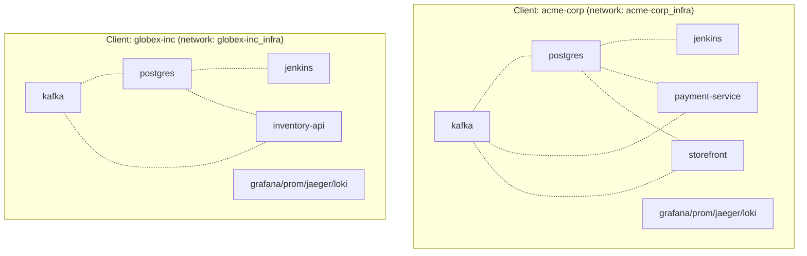

# 0002. Each client environment is fully isolated

- **Status:** Accepted
- **Date:** 2026-04-18
- **Deciders:** @cavanpage

## Context

The original blissful-infra topology was "flat": one `blissful-infra start
<project>` produced a single project directory with backend, frontend, kafka,
postgres, observability, and a globally-shared Jenkins running outside any
project. This worked for a single project, but blissful-infra's actual user
is "a solo developer or agency managing multiple client projects", and the
flat model didn't support that:

- A second project would conflict on every port (8080, 3000, 5432, 9094, ...)
- Jenkins was global, one Jenkins instance shared by all projects, with no
  client-confidentiality story (one client's pipelines visible to another's)
- Postgres was per-project but other infra (Kafka, observability) was either
  duplicated awkwardly or shared with leakage risks
- The mental model didn't match real engineering teams (a platform team
  owns shared infra; individual services plug into it)

The pivotal product question was: at what level should the unit-of-isolation
sit?

## Decision

The **client environment** is the unit of isolation. A client owns its own:

- Docker network (`<client>_infra`)
- Kafka, Postgres, Jenkins
- Full observability stack (Prometheus, Grafana, Jaeger, Loki, Promtail,
  optionally ClickHouse)
- Port block (deterministic per `blockIndex`, allocated in
  `~/.blissful-infra/registry.json`)
- Filesystem root (`~/.blissful-infra/clients/<name>/`)

Within a client, **services** share that client's infra. A service
(backend + optional frontend + per-service plugins) joins the client's
network as part of the unified Compose project (see ADR-0003). Services
talk to kafka/postgres/jaeger by service name within the network.

**No resources are shared across clients.** `acme-corp`'s kafka and
`globex-inc`'s kafka are entirely separate containers on entirely separate
Docker networks.

## Consequences

### Positive

- **No accidental cross-client leakage.** Network-level isolation is
  OS-enforced, not policy-enforced.
- **Mental model matches real teams.** Platform-team-owns-infra,
  service-team-plugs-in. Maps cleanly to what users come from.
- **Per-client port blocks** (allocated `+blockIndex`) let multiple
  clients run simultaneously on one laptop. Pre-flight port check
  (`allocateFreePortBlock`) auto-bumps to the next free block when
  collisions happen.
- **Per-client Jenkins** means client-confidentiality story works
  (one client's pipelines invisible to another's; matches how agencies
  actually need to operate).
- **Backwards compatibility preserved.** The legacy `blissful-infra start`
  flat model is now a degenerate case (single-service client) and continues
  to work.

### Negative

- **More resources per client.** Each client runs its own kafka, postgres,
  jenkins, prometheus, grafana, jaeger, loki, roughly 12 containers
  before any service. Two clients = ~24 containers running. A laptop
  can comfortably run one or two; three is painful.
- **First-time Jenkins build is slow.** The Jenkins image (`blissful-jenkins:latest`)
  takes ~2 min to build on first client create. Cached afterward.
- **No cross-client visibility.** A user managing five clients has to switch
  between five Grafanas, five Jaegers. Acceptable per the
  client-confidentiality goal.

### Risks / follow-ups

- **Resource pressure.** As users add more clients, eventually we'll need
  a "cold start" mode where infra shuts down when no service is making
  requests. Not built; punt until users hit the wall.
- **Shared-host port budget.** Port blocks consume ~7 host ports each
  (jenkins, grafana, prometheus, jaeger, kafka, postgres, dashboard).
  At blockIndex 100 we'd be at port 8190. The current `+blockIndex`
  scheme assumes single-digit-to-low-double-digit blocks. Re-evaluate
  if we ever ship clients-as-a-service over a shared dev environment.
- **`unregisterClient` does NOT reset `nextBlockIndex`.** Removing the only
  client and creating a new one bumps blockIndex anyway. Cosmetic; flagged
  as a small bug to fix.

## Alternatives considered

- **Shared infra across clients** (one Jenkins, one Kafka, one Postgres
  serving all clients via namespacing)., Rejected because of
  client-confidentiality leakage risks (one tenant's logs in another
  tenant's Loki) and because "platform team owns infra" makes more sense
  as one-stack-per-tenant.
- **Per-service isolation** (each service is its own network/postgres).
Rejected because real teams share infra at the org level, not the
  service level. Three services per client = 3× kafka, 3× postgres = wasteful
  and unrealistic.
- **Naming-convention isolation** (`acme-frontend`, `acme-backend` as
  separate flat-model projects)., Rejected because it pushes the entire
  burden of consistency to the user (must remember which projects are
  related), and doesn't help with shared-vs-isolated decisions per
  resource type.
- **Kubernetes-style namespaces** (one Docker host, multiple logical
  namespaces)., Docker doesn't have first-class namespaces. Compose
  project names are the closest analog, but they don't enforce network
  isolation by default. Caddied together it'd be reinventing k8s
  poorly. Rejected.

## References

- [specs/client-model.md](../../specs/client-model.md), full feature spec
- [packages/cli/src/commands/client.ts](../../packages/cli/src/commands/client.ts), implementation
- [packages/cli/src/utils/client-registry.ts](../../packages/cli/src/utils/client-registry.ts), port allocation
- ADR-0003 (unified Compose project per client), the *how* that follows
  from this *what*
