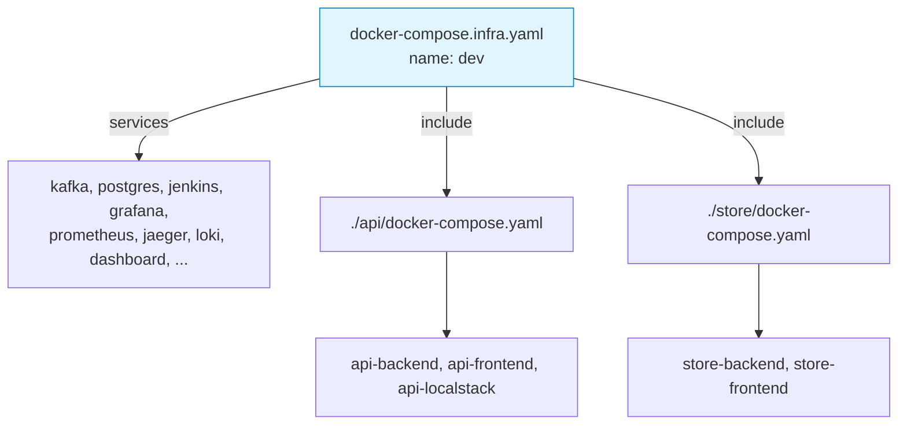

# 0003. One Compose project per client, services attached via `include:`

- **Status:** Accepted
- **Date:** 2026-04-28
- **Deciders:** @cavanpage

## Context

ADR-0002 established that each client gets its own isolated stack
(network, kafka, postgres, jenkins, observability). The first
implementation made each service its own separate Compose project on top
of that:

- `<client>` Compose project — owns the infra (kafka, postgres, jenkins, ...)
- `<client>-<service>` Compose project — owns the service (backend,
  frontend, localstack), joins `<client>_infra` as an *external* network

This worked but caused a string of related problems:

- **Two namespaces.** `docker compose ls` showed a row per service plus
  one per client. `docker compose ps` from the client dir only showed
  half the picture.
- **`depends_on` doesn't cross projects.** A service's backend can't
  `depends_on: kafka` because kafka is in a different Compose project.
  The service's healthcheck has to retry-until-reachable, which means
  longer startup and worse failure modes when infra isn't actually up.
- **Per-service compose files duplicated network declarations.** Each
  re-declared `infra` as `external: true`, creating a maintenance
  burden and the bug captured in ADR-0001 (the `external: true` flag
  bleeding through include-merge).
- **Operations had to iterate.** `client up` had to bring up the infra
  project, then iterate through every service compose and bring each up
  separately. Lots of code, lots of failure surfaces.
- **Container-name collisions** between services. Each service's compose
  ran in its own project but used unprefixed container names like
  `backend`/`frontend`. Two services in the same client would collide.

The pivotal user observation: *"it still is creating 2 namespaces/images
in docker"* — they wanted everything under one umbrella.

## Decision

Use Docker Compose's `include:` directive (Compose v2.20+) to merge each
service's compose file into the **client's parent** Compose project. The
result is exactly **one Compose project per client**, named after the
client.

### Topology

### Implementation specifics

- Parent compose file declares `name: <clientName>` and `include:` is
  populated with the relative path to each service's docker-compose.yaml.
- Service compose files are *merged into the parent project* — they no
  longer declare `name:` of their own.
- Service keys are **prefixed** to avoid collisions in the merged service
  map: `<service>-backend`, `<service>-frontend`, `<service>-localstack`.
- Container names use the same scheme: `<client>-<service>-<role>`.
- The `infra` network is owned by the parent (`infra: { name: <client>_infra
  }`). Service compose files **do not** declare it as `external: true` (see
  ADR-0001 for why that bites — `external: true` bleeds through include
  merge and breaks the create-network-on-first-up flow).
- Each service still gets its own per-service local network
  (`<service>-internal`) for frontend↔backend↔localstack DNS, with the
  backend aliased as `backend` on that network so the React-Vite nginx
  config (`proxy_pass http://backend:8080/`) keeps working unmodified.
- `service add` regenerates the parent compose's `include:` list and runs
  one `docker compose -f docker-compose.infra.yaml up -d --build`.
- `client up`/`down`/`status`/`remove` operate on the parent compose only —
  no per-service iteration.
- `service up`/`down`/`logs` operate on the parent compose with prefixed
  service-key arguments (`docker compose ... up -d <service>-backend
  <service>-frontend ...`).

## Consequences

### Positive

- **One namespace.** `docker compose ls` shows one row per client.
  `docker compose ps` shows infra + all services together.
- **Cross-service `depends_on` works.** A service backend can
  `depends_on: kafka: condition: service_healthy` — they're in the same
  project. Faster, more deterministic startup.
- **Single-call lifecycle.** `client up` is one command, not "infra up
  then iterate services."
- **Less code.** Removed the per-service iteration loops in `clientUpAction`,
  `clientDownAction`, `clientRemoveAction`.
- **Service files stay self-contained on disk** — they're still per-service
  yaml files at `<client-dir>/<service>/docker-compose.yaml`, just merged
  at runtime. Easy to read, edit, version-control.

### Negative

- **`docker compose up` from a service dir alone no longer works.**
  Service compose files reference an `infra` network that the parent
  declares; running them standalone fails. The CLI never does this, but
  a power user editing files manually might. Documented.
- **Compose v2.20+ required.** `include:` is recent. Users on older
  Compose versions get a confusing error. Not actually a concern in
  practice (Docker Desktop 4.25+ has it, all current Linux distros'
  Docker have it) but worth noting.
- **Service key prefixing means the templates can't use `backend` as a
  literal key.** Service compose files use `<service>-backend` etc. The
  network-alias trick (`backend` as alias on `<service>-internal`) papers
  over this for nginx, but anyone writing custom service compose has to
  know the convention.

### Risks / follow-ups

- **Path resolution inside includes.** Build contexts (`./backend`) inside
  an included file resolve relative to the included file, not the parent.
  Got this right by accident; would benefit from an L2 test. (Already
  partially covered by the `regenerateInfraCompose` test.)
- **`include:` can be nested.** Today we don't, but if a service grew
  multiple compose files (`compose.yaml` + `compose.dev.yaml`), the
  picture gets more complex. ADR if/when we go there (see follow-up:
  hot-reload `--dev` flag).
- **External tooling that expects "one compose project per service".**
  Some external CD/deploy tooling assumes the per-service-project layout.
  We don't have any such tooling integrated, but if we add one (e.g.
  Lagoon, Coolify), we may need to expose a per-service view.

## Alternatives considered

- **Multiple `-f` flags at runtime** (`docker compose -f infra.yaml -f
  service-a.yaml -f service-b.yaml up`). Functionally similar to `include:`,
  but every CLI invocation has to know all service paths and rebuild the
  flag list. Regenerating an `include:` list once at `service add` time
  and using a single `-f` flag thereafter is cleaner. Rejected.
- **Profiles instead of separate files** (`profiles: [service-a]` on
  service blocks in one giant compose file). Compose profiles toggle
  services on/off but don't help with file layout — we'd still need a
  way to add/remove service definitions, and editing one giant file is
  worse for human ergonomics. Rejected.
- **Keep the two-project layout, fix bugs as they come.** This is what
  we had. The string of bugs (depends_on, external network leakage,
  container-name collisions, fragmented `docker compose ps`) suggested
  the architecture itself was wrong, not the individual bugs. Rejected.
- **Custom Compose plugin.** Compose has plugin authoring. We could've
  written a `blissful-compose` Compose plugin that does the merge in our
  own way. Massive over-engineering for a problem `include:` already
  solves. Rejected immediately.

## References

- ADR-0002 (per-client isolation) — the prerequisite
- ADR-0001 (Caddy edge proxy) — sits inside this same parent project
- [packages/cli/src/utils/infra-compose.ts](../../packages/cli/src/utils/infra-compose.ts) —
  generation
- [packages/cli/src/commands/service.ts](../../packages/cli/src/commands/service.ts) —
  service compose generation, container-name prefixing
- [Compose Specification: include](https://github.com/compose-spec/compose-spec/blob/main/14-include.md)
