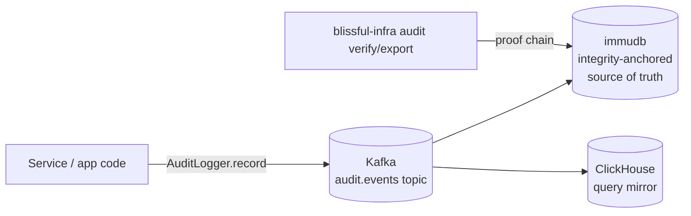

# 0011. Compliance-grade audit logging via immudb + Kafka + ClickHouse

- **Status:** Proposed
- **Date:** 2026-05-04
- **Deciders:** @cavanpage

## Context

blissful-infra targets students, new grads and indie engineers learning enterprise patterns. Real production systems require audit logging that meets a regulatory bar. SOC2, HIPAA, SOX. Most "audit log" tutorials online stop at "INSERT into an `audit` table", which is not compliance-grade: a database admin with superuser can rewrite history without detection.

We want the local sandbox to demonstrate **how compliance-grade audit logging is actually built**: append-only, tamper-evident with cryptographic proofs, separated read/write roles, retention policies, and a verify path that a third-party auditor can run independently. The application-level "audit trail + soft deletes" work already on the Spring Boot roadmap ([timeline.md §6.10.10](../../specs/timeline.md)) is complementary but addresses a different need (domain history), not regulatory integrity.

## Decision

Add **compliance-grade audit logging as client-level infrastructure**, opt-in via `infrastructure.audit: true` in the client config. The architecture has three components:

- **Source of truth: [immudb](https://github.com/codenotary/immudb)**: open source, runs in Docker, Merkle-tree backed, exports cryptographic proofs. This is the integrity anchor; nothing else can serve that role.
- **Fan-out: Kafka topic `audit.events`**: same plumbing pattern as the analytics pipeline ([specs/analytics.md](../../specs/analytics.md)). Decouples writers from storage and lets multiple sinks consume independently.
- **Query mirror: ClickHouse**: for dashboard queries and analytics. Re-derivable from immudb. Not a source of truth.
- **Standardized event schema**: CloudEvents-shaped: `actor`, `action`, `resource`, `outcome`, `timestamp`, `traceId`, `metadata` (jsonb). Cross-service consistency.
- **Pseudonymous-only payloads, load-bearing for GDPR right-to-erasure ([ADR-0012](./0012-data-governance-and-dsar-enforcement.md)):** audit entries MUST NOT contain raw PII (names, emails, IPs, free-text user content). They reference subject IDs only. The subject-ID-to-person mapping lives in the identity vault defined by ADR-0012 and is tombstone-able. After tombstoning, audit history remains intact and cryptographically verifiable, but is no longer linkable to a real person. This rule is enforced by the `AuditLogger` bean (rejects payloads matching a PII regex/heuristic) and by a CI check that scans for direct-PII references in `auditLogger.record(...)` call sites.
- **Spring Boot template:** an `AuditLogger` bean that emits to the Kafka topic. App code calls `auditLogger.record(...)`; it never touches immudb directly.
- **CLI surface:**
  - `blissful-infra audit verify <client>`, walks immudb's proof chain and reports tamper status
  - `blissful-infra audit export <client> [--since <ts>]`, produces a signed bundle (immudb proof + ClickHouse export) for external auditors
- **Retention:** time-based, configurable per client, default 7 years (SOX-compatible). immudb supports configurable truncation; older entries are sealed into archive bundles in `~/.blissful-infra/clients/<name>/audit-archive/`.
- **Access separation:** immudb has built-in role separation. Apps write via `audit-writer` credentials. Reads go through ClickHouse (public mirror, queryable by dashboard). High-trust reads use a separate `audit-reader` role on immudb directly.

This becomes part of the client-level platform-services family alongside ClickHouse ([ADR-0008](./0008-clickhouse-as-client-level-warehouse.md)), Keycloak ([ADR-0009](./0009-keycloak-as-client-level-iam.md)), and the ai-pipeline decomposition ([ADR-0010](./0010-decompose-ai-pipeline-plugin.md)).

## Consequences

- **Positive:**
  - Demonstrates a genuine compliance-grade pattern that a student can take to a real SOC2/HIPAA workplace
  - Reuses existing infra (Kafka, ClickHouse), only one new component (immudb)
  - Verify command gives a concrete, runnable answer to "how do you prove the log wasn't tampered with"
  - CloudEvents-shaped schema is portable to other auditing ecosystems (e.g. AWS EventBridge, Cloud Audit Logs)
- **Negative:**
  - One more client-level service to learn and operate (immudb has its own gRPC client and schema)
  - Two storage systems for the same data (immudb + ClickHouse), needs reconciliation tests
  - Kafka becomes a hard dependency of the audit pipeline; if Kafka is down, audit writes pile up in a local outbox
- **Risks / follow-ups:**
  - **Outbox pattern is mandatory**: apps must write to a transactional outbox before publishing to Kafka, or we lose audit events on crash. This dovetails with the existing transactional-outbox work ([timeline.md §6.10.5](../../specs/timeline.md))
  - **Time integrity:** for true compliance, timestamps should come from a trusted source. Local dev uses host NTP; a future enhancement could integrate RFC 3161 trusted timestamps for the highest grade
  - **Schema evolution:** the audit schema is part of the integrity proof. Changes to required fields require a versioned schema and a chain anchor that records the schema version
  - **Open question, signing keys for export bundles:** per-client key generated at `client create`? Centralized signing? Defer to implementation, but the export contract needs a stable answer

## Alternatives considered

- **Postgres with hash-chain trigger**: rejected as the source of truth: a DBA with superuser can rewrite the chain undetected, so it isn't compliance-grade. Acceptable as the *ClickHouse-equivalent* mirror, but immudb is a better fit since it's purpose-built and roughly the same operational cost.
- **AWS QLDB**: rejected: cloud-only, costs money, contradicts the local-first product positioning. Re-evaluate if a "compliance pack" is ever offered as a hosted add-on.
- **Append-only file + WORM storage**: rejected: poor queryability, no proof export, hard to reconcile with the dashboard story.
- **Skip immudb, use Postgres with hash-chain only**: rejected: would force the docs to either oversell what the demo proves (dishonest) or undersell it ("here's a partial pattern"). Better to ship the real primitive.
- **Application-level audit only (no client-level infra)**: rejected: each service would invent its own scheme, no cross-service consistency, no verify command. Compliance-grade requires a system boundary, not a per-service convention.

## References

- [specs/analytics.md](../../specs/analytics.md). Kafka → ClickHouse pipeline pattern reused here
- [ADR-0008](./0008-clickhouse-as-client-level-warehouse.md). ClickHouse as client-level infra
- [ADR-0010](./0010-decompose-ai-pipeline-plugin.md), client-level platform-services pattern
- [timeline.md §6.10.5](../../specs/timeline.md), transactional outbox (load-bearing for audit reliability)
- [timeline.md §6.10.10](../../specs/timeline.md), application audit trail + soft deletes (complementary, not a substitute)
- [ADR-0012](./0012-data-governance-and-dsar-enforcement.md), data governance and DSAR enforcement (defines the identity-vault tombstone pattern that this ADR depends on)
- [immudb](https://github.com/codenotary/immudb). Merkle-tree-backed immutable database
- [CloudEvents spec](https://cloudevents.io/), event schema standard
- [RFC 3161](https://datatracker.ietf.org/doc/html/rfc3161), trusted timestamps (future enhancement)
