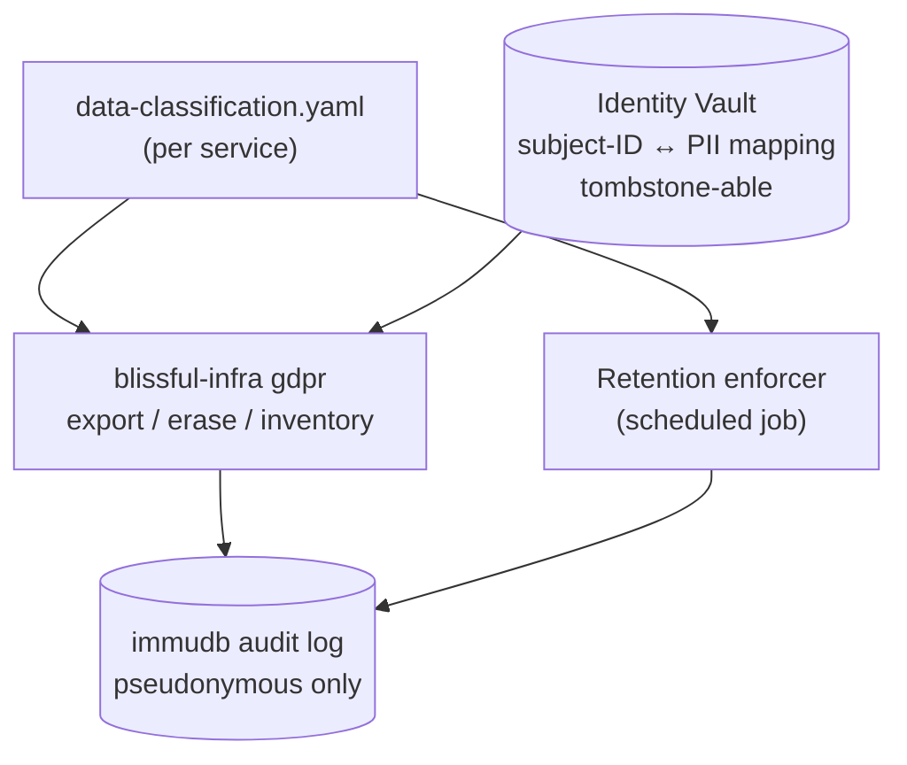

# 0012. Data governance and DSAR enforcement via a per-service classification manifest

- **Status:** Proposed
- **Date:** 2026-05-04
- **Deciders:** @cavanpage

## Context

A production application doesn't just need to log who-did-what ([ADR-0011](./0011-compliance-grade-audit-logging.md)), it needs to **know what personal data it stores, where, on what legal basis, and for how long**. GDPR (Art 15 access, Art 17 erasure, Art 30 records of processing), CCPA, and HIPAA all converge on the same architectural requirement: a system-of-record that catalogues data flows, plus an executable path to satisfy a Data Subject Access Request (DSAR) within statutory deadlines (e.g., GDPR's 30 days).

Most tutorials handle right-to-erasure with `DELETE FROM users WHERE id = ?`. Real systems have data scattered across Postgres tables, Redis caches, Kafka topics, ClickHouse warehouses, Loki logs, S3 buckets, and snapshot backups. Forgetting one of those is a regulatory finding. The local sandbox is the right place to demonstrate **how this is done correctly**: discoverable, auditable, and complete, because a student who learns the wrong pattern in their first job will repeat it for years.

This ADR is intentionally tightly coupled to [ADR-0011](./0011-compliance-grade-audit-logging.md): the immutable audit log conflicts with right-to-erasure unless the audit payloads are pseudonymous and the subject-ID-to-person mapping is tombstone-able. Both ADRs must ship together to be coherent.

## Decision

Add **data governance as a first-class concern** with four components:



### 1. Per-service data-classification manifest

Every backend / frontend / plugin template ships a `data-classification.yaml` declaring every piece of data it stores:

```yaml
# packages/cli/templates/spring-boot/data-classification.yaml
- field: users.email
  storage: postgres:default:users   # ADR-0014 qualifier — instance:database
  classification: pii
  legalBasis: contract        # GDPR Art 6(1)(b)
  retention: P7Y              # ISO 8601 duration
  residency: any              # eu-only | us-only | any
  erasure: delete             # delete | anonymize | tombstone
  exportPath: $.user.email    # JSONPath in DSAR export bundle

- field: users.passwordHash
  storage: postgres:default:users
  classification: sensitive
  legalBasis: contract
  retention: P7Y
  erasure: delete

- field: orders.line_items
  storage: postgres:legacy:orders   # different instance + different database
  classification: sensitive
  legalBasis: contract
  retention: P7Y
  erasure: delete

- field: events.payload
  storage: kafka:user-events
  classification: pii
  legalBasis: legitimate-interest
  retention: P30D
  erasure: anonymize          # rewrite topic with subject-ID nulled

- field: traces.userId
  storage: loki
  classification: pseudonymous
  legalBasis: legitimate-interest
  retention: P30D
  erasure: anonymize          # tombstone the subject-ID, keep traces
```

Schema lives in `packages/shared/src/schemas/data-classification.ts`. The CLI validates manifests at build time. Missing classification on a known storage backend is a hard error.

### 2. Identity vault, the single PII-to-subject-ID mapping

A dedicated Postgres schema `identity_vault` (in the per-client Postgres instance named `default`, per [ADR-0014](./0014-multiple-postgres-instances-per-client.md)) is the **only** place where the mapping `subject_id ↔ (email, name, phone, ...)` lives. Every other system (audit log, traces, analytics, application tables) references `subject_id` only.

- Created automatically when `infrastructure.governance: true` is set in the client config.
- Has its own role: `vault-writer` (insert + read-own-row only), `vault-reader` (full read for DSAR fulfillment).
- **Tombstoning** sets the PII columns to NULL and writes an audit event. The subject_id remains a stable key; the link to a person is severed.
- Unlike normal application data, the vault is **excluded from regular backups** by default, backups encrypt the PII columns with a per-client key, and tombstoning rotates the key fragment, rendering historical backup copies unreadable (crypto-shredding pattern).

This pattern resolves the audit-log paradox declared in ADR-0011: audit history is immutable, but the link from `subject_id` to a real person is not.

### 3. DSAR CLI primitives

```bash
blissful-infra gdpr inventory <client>
# Lists all data the client stores, by classification, with retention/legal-basis. Drives compliance reports.

blissful-infra gdpr export <client> <subject-id> [--out bundle.zip]
# Walks the manifest, fetches all data referencing <subject-id> across every storage system,
# produces a portable bundle. Records the request in the audit log.

blissful-infra gdpr erase <client> <subject-id> [--reason ...]
# Walks the manifest. For each field:
#   erasure: delete    → DELETE the row
#   erasure: anonymize → set subject_id-bearing columns to a tombstone sentinel
#   erasure: tombstone → identity-vault tombstone only (audit log path)
# Records every step in the audit log with cryptographic proof of completion.
# Produces a certificate of erasure (signed) for the subject's records.
```

Each storage backend has an adapter implementing `export(subjectId)` and `erase(subjectId, mode)`: Postgres, Redis, Kafka (compaction or rewrite), ClickHouse (lightweight DELETE or anonymize), Loki (label-based redaction), S3/LocalStack (object filtering), immudb (tombstone-only, never delete).

### 4. Retention enforcement

A scheduled job (per client) walks the manifest and enforces retention windows:

- Postgres: `DELETE WHERE created_at < now() - retention`
- Kafka: topic retention configured from manifest at `client up`
- ClickHouse: `TTL` clauses generated from manifest
- Loki: retention config generated from manifest

The enforcer emits an audit event for each batch deleted (count, table/topic, reason: `retention-policy`).

### 5. Consent + lawful basis tracking

Extends [ADR-0009 Keycloak](./0009-keycloak-as-client-level-iam.md) with a `consents` custom attribute per user, and a `ConsentService` bean in the Spring Boot template. Every data-collection point checks consent before writing. Withdrawal of consent triggers a partial erasure scoped to fields whose `legalBasis` is `consent`.

### 6. Data residency

The `residency` field on each manifest entry (`eu-only | us-only | any`) is informational in local mode but becomes load-bearing once cloud-deploy targets exist ([specs/cloud-deploy.md](../../specs/cloud-deploy.md)). The deploy dispatcher refuses to deploy a service to a region that violates the residency declaration.

## Consequences

- **Positive:**
  - Right-to-erasure becomes an executable command, not a wiki page
  - Manifest is the single source of truth for what data exists, fed by both DSAR and retention paths
  - Resolves the audit-log paradox cleanly (pseudonymous + tombstone). ADR-0011 stays coherent
  - Crypto-shredding pattern handles the hardest part of right-to-erasure: deletion from backups
  - Manifest format generalizes, same schema can drive cloud-residency enforcement when cloud-deploy lands
  - Demonstrates a real-world pattern (data-mesh-style governance) instead of "just delete the row"
- **Negative:**
  - Every template now has a manifest to maintain. Drift between code and manifest is the main risk.
  - The Kafka erasure path is genuinely hard (topics aren't trivially mutable). Anonymization-by-rewrite is the only honest option and it's expensive.
  - Identity vault is a single point of failure for re-identification, needs careful access controls and backup handling.
  - Adds operational complexity (a scheduled retention job, manifest validation in CI, adapters per backend).
- **Risks / follow-ups:**
  - **Backup deletion is the hardest thing in GDPR.** Crypto-shredding is the accepted answer for cloud-scale; on local backups it's overkill. Document the trade-off explicitly so users don't think "delete from Postgres" is sufficient.
  - **Manifest-code drift detection:** need CI lint that scans schema migrations + Kafka topic creations for fields not declared in the manifest. Phase-2 work.
  - **DSAR deadline:** statutory deadlines (GDPR 30 days) imply an SLO on the erase command. Worth a follow-up spec on how to meter and alert on DSAR queue age.
  - **Sub-processor / data-flow records (GDPR Art 30):** the manifest is half of the Records of Processing requirement. The other half, sub-processors, recipients, needs a separate file or extension to the manifest.

## Open questions

- **Where does the identity vault physically live?**
  - Option A: dedicated Postgres schema in the per-client Postgres (proposed above), simplest, reuses existing infra.
  - Option B: separate Postgres instance with restricted network access, stronger isolation, more operational cost.
  - Option C: Keycloak custom attributes, leverages existing IdP, but Keycloak isn't optimized as a general PII store and querying it is awkward.
  - Recommend Option A for the local sandbox; document Option B as the production hardening path.
- **Per-client signing key for DSAR / audit export bundles**: generated at `client create` and stored where? Filesystem (`~/.blissful-infra/clients/<name>/keys/`)? OS keychain? Defer to implementation but the contract needs a stable answer.
- **Cross-client erasure**: out of scope. Clients are isolated by design ([ADR-0002](./0002-per-client-isolation-model.md)). A subject who appears in multiple clients triggers multiple separate DSARs.
- **Pseudonymous-but-still-identifiable fields** (e.g., precise GPS, browser fingerprints): the manifest needs a stricter classification than `pseudonymous` for these. Add `quasi-identifier` as a fourth class, and require it to declare what re-identification mitigations apply.

## Alternatives considered

- **Skip governance, document it as "user's responsibility"**: rejected: the product is positioned as teaching enterprise patterns. Hand-waving on data governance teaches the wrong thing.
- **Manifest in code (annotations) instead of YAML**: rejected: code is per-service per-language; YAML is portable across all backends and tool-readable by the CLI without parsing each language.
- **Use a hosted data catalog (Atlan, Collibra, OpenMetadata)**: rejected: heavyweight, not local-first, and the value here is showing the pattern, not integrating an enterprise SaaS.
- **Skip the identity vault, store PII inline everywhere with a tombstone column**: rejected: tombstoning inline doesn't help audit-log paradox (audit log still has the PII), and "delete from N tables" is exactly the failure mode the vault prevents.
- **Hard-delete from immudb on erasure**: rejected: violates the integrity guarantee of ADR-0011. Pseudonymous-payload + vault-tombstone is the only resolution that preserves both properties.

## References

- [ADR-0002](./0002-per-client-isolation-model.md), per-client isolation (defines erasure scope)
- [ADR-0009](./0009-keycloak-as-client-level-iam.md). Keycloak (extended here for consent tracking)
- [ADR-0011](./0011-compliance-grade-audit-logging.md), compliance-grade audit logging (depends on this ADR's pseudonymous rule)
- [ADR-0014](./0014-multiple-postgres-instances-per-client.md), multiple Postgres instances (defines the `instance` dimension of the `storage:` qualifier)
- [specs/cloud-deploy.md](../../specs/cloud-deploy.md), residency field becomes load-bearing once cloud deploy ships
- [GDPR Art 15](https://gdpr-info.eu/art-15-gdpr/), right of access
- [GDPR Art 17](https://gdpr-info.eu/art-17-gdpr/), right to erasure
- [GDPR Art 30](https://gdpr-info.eu/art-30-gdpr/), records of processing
- [Crypto-shredding](https://en.wikipedia.org/wiki/Crypto-shredding), pattern for backup-resident PII deletion
