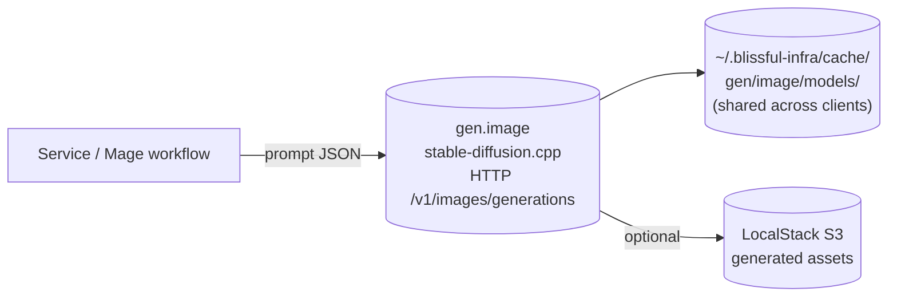

# 0013. Local image generation as `infra.gen.image` plugin

- **Status:** Proposed
- **Date:** 2026-05-04
- **Deciders:** @cavanpage

## Context

Indie studios and solo creators using blissful-infra to build content tools (Cadence, the social-post generator POC, is the immediate driver) need cheap visual content alongside generated text. Today the platform ships local LLM inference (ai-pipeline + Ollama, [ADR-0010](./0010-decompose-ai-pipeline-plugin.md)) but no image generation. Users are pushed back to paid SaaS (Midjourney, DALL-E, Nano-banana) which contradicts the local-first product positioning ([specs/product.md](../../specs/product.md)) and the "no credit card required" promise to students and small studios ([target audience memory](../../specs/product.md)).

The user feedback that triggered this: *"i want it to create images with inference, cheap local models i can run on llama.cpp or whatever is easiest to deploy."*

We need a local image-generation primitive that:

- Runs on a laptop CPU, GPU optional
- Has no external API spend
- Ships as a Docker container, consistent with the rest of the platform
- Reserves room for sibling generative components (video, audio) without further structural churn

## Decision

**Add local image generation as a client-level platform service**, opt-in via `infra.gen.image: true` in the client config. Introduce a new `gen` namespace under `ClientInfrastructure` to hold this and future generative components.



### What changes

1. **New schema namespace:** `Clientinfra.gen: { image?: boolean }`. First nested infra namespace in the schema; existing flags stay flat. Future siblings (`gen.video`, `gen.audio`) slot in here without re-shaping.
2. **Runtime:** [stable-diffusion.cpp](https://github.com/leejet/stable-diffusion.cpp) — single C++ binary, CPU-capable, GPU opt-in (CUDA / Metal / Vulkan), Apache-2, supports SD 1.5 / SDXL / SD3 / Flux. Direct analog to llama.cpp.
3. **Container:** `<client>-gen-image` on the client `infra` network. Exposes an **OpenAI-images-compatible HTTP API** (`POST /v1/images/generations`) so callers (Mage workflows, Spring Boot services, the dashboard) speak a familiar shape and can swap to OpenAI's hosted endpoint later by changing one env var.
4. **Default model:** SD 1.5 (~1.7 GB). Opt-in heavier models via env: `BLISSFUL_GEN_IMAGE_MODEL=sdxl-turbo | flux-schnell | sd3-medium`.
5. **Model cache:** weights live at `~/.blissful-infra/cache/gen/image/models/`, **shared across clients** (weights are static, large, not per-client state). Same pattern Docker uses for image layers.
6. **GPU:** opt-in via `infra.gen.image: { gpu: true }` (object form unlocks per-flag config). Adds Compose `deploy.resources.reservations.devices` block for NVIDIA. Apple Silicon uses Metal automatically when the host exposes it. Default CPU.
7. **Port allocation:** `PortBlockSchema` gains `genImage: number`, allocated `7860 + blockIndex` (nod to Automatic1111's conventional port).
8. **Env wiring (template guards):** services that opt into `gen.image` get `IMAGE_GEN_URL=http://gen-image:7860/v1` injected into compose, plus `{{#IF_gen_IMAGE}} ... {{/IF_gen_IMAGE}}` blocks in spring-boot / react-vite / lambda templates. Mirrors the keycloak / localstack wiring pattern that landed 2026-05-04.
9. **CLI surface:** `blissful-infra client infra add <client> gen.image` and `... remove ...` toggle the flag on existing clients (extends the `infra-deps` manifest from the existing TODO list).
10. **Asset persistence:** generated images are returned in the HTTP response (base64 or URL). For long-term storage, callers POST them to LocalStack S3 themselves; the plugin does not own asset lifecycle.

### Schema shape

```yaml
infrastructure:
  gen:
    image: true                    # boolean form, defaults model + CPU
  # OR object form for non-default config:
  gen:
    image:
      model: sdxl-turbo
      gpu: true
      maxConcurrency: 2
```

Both forms accepted; boolean is sugar for `{ model: 'sd15', gpu: false, maxConcurrency: 1 }`.

### What is intentionally NOT in this ADR

- **`gen.text` and `gen.audio` and `gen.video`.** Reserving the namespace; concrete components are separate ADRs. `gen.text` overlaps with the existing ai-pipeline / Ollama path and would require a migration discussion better held on its own.
- **ComfyUI or Automatic1111 as a swap-in runtime.** Stronger feature set (ControlNet, LoRA, inpainting) but heavier image and graph-based API. Earmark as a future runtime option behind `infra.gen.image.runtime: comfyui`. Not built now.
- **Auto-uploading generated images to social platforms.** Out of scope; matches the v0 stance for Cadence (export-and-you-upload).
- **Model fine-tuning / LoRA training.** Inference only. Training belongs near MLflow ([ADR-0010](./0010-decompose-ai-pipeline-plugin.md)) if/when it lands.
- **Content safety / NSFW filtering.** stable-diffusion.cpp ships with a configurable safety check; default on, document the off switch. A real moderation pipeline is future work.

## Consequences

### Positive

- **Closes the "$0 API spend" story for image-heavy workflows.** Cadence and similar content tools can ship without an OpenAI / Stability / Midjourney bill.
- **Real generative-AI primitive students can take to a job.** stable-diffusion.cpp is the same runtime real teams use for cost-controlled inference; the OpenAI-compatible API shape is the same one production stacks bridge through.
- **Coherent with the rest of the platform.** Same shape as keycloak / localstack / clickhouse / mlflow / mage: client-level, opt-in, on the infra net, template-guarded.
- **Cloud migration path is one env var.** `IMAGE_GEN_URL` flips to OpenAI / Replicate / Fal.ai when a studio wants quality > cost.
- **Reserves namespace cleanly.** `gen.video` and `gen.audio` slot in without churn when the time comes.

### Negative

- **CPU image generation is slow.** SD 1.5 at 512×512 on a modern laptop CPU is 20–60s per image. Acceptable for batch / overnight queues (Cadence's review-queue model fits this); painful for synchronous UX. Document plainly.
- **Quality on small models is "fine, not great."** SD 1.5 produces images suitable for IG carousels, blog headers, stock-style placeholders, not magazine covers. SDXL / Flux narrow the gap but at 6–12 GB and slower CPU times. Honest framing in docs.
- **Disk footprint is non-trivial.** SD 1.5 ≈ 1.7 GB, SDXL Turbo ≈ 6 GB, Flux Schnell ≈ 12 GB. Shared cache mitigates but first-run pulls are large.
- **First introduction of a nested infra namespace.** `gen.image` breaks the flat `ClientInfrastructure` convention. Schema migration is mechanical (Zod accepts both shapes during a deprecation window) but it's a structural choice that other generative components are now committed to follow.
- **GPU passthrough adds friction.** NVIDIA Container Toolkit on Linux, Metal on macOS works automatically, Windows users need WSL2 + CUDA. Documented as opt-in.

### Risks / follow-ups

- **Model licensing.** SD 1.5 is CreativeML Open RAIL-M; SDXL is CreativeML Open RAIL++-M; Flux is non-commercial for the dev variant, Apache-2 for Schnell. Default to permissive (SD 1.5, Flux Schnell). Document license per model so users shipping commercial work can pick correctly.
- **Safety / moderation.** Default safety check on. A determined user can disable it. Not the platform's job to enforce, but document the trade explicitly so studios know their position.
- **Concurrency control.** stable-diffusion.cpp processes one request at a time per process. `maxConcurrency` flag controls how many worker processes the container spins up. Default 1 (CPU-bound) to avoid laptop meltdown; document the trade.
- **The nested-namespace precedent.** Once `gen.*` exists, pressure mounts to nest other groupings (`auth.*`, `analytics.*`). Worth a short follow-up note when the second nested group is proposed; for now, `gen.*` stands alone.

## Alternatives considered

- **Skip local image gen, document a Replicate / Fal.ai integration instead.** Rejected: contradicts the local-first, no-credit-card positioning. Cloud-API integration can be a sibling option, but not the default.
- **ComfyUI as the default runtime.** Considered. Richer feature set (ControlNet, LoRA, graph workflows) but heavier image (~3 GB), graph-based API harder to call from a Mage workflow, GPU practically required for usable speed. Better as an opt-in future runtime than a default.
- **Automatic1111 / SD.Next.** Hobbyist-focused web UIs. Not designed as headless services; HTTP API is a bolt-on. Heavier than stable-diffusion.cpp, lighter than ComfyUI, but worse fit for either "easy default" or "production swap-in."
- **HuggingFace Diffusers (Python service).** More flexible (any model on HF), but Python + PyTorch image is 5+ GB and CPU inference is slower than stable-diffusion.cpp's optimized C++. Re-evaluate if users need models stable-diffusion.cpp doesn't support.
- **Flat `infrastructure.imageGen: true` instead of nested `gen.image`.** Considered. Simpler now, but means every future generative component is a top-level flag (`videoGen`, `audioGen`, `textGen` colliding with the existing ai-pipeline). The nested namespace pays a one-time schema cost for long-term cleanliness. User explicitly asked for the nested form.
- **Per-service image-gen container (like the old per-service ClickHouse / LocalStack).** Rejected for the same reason ADR-0008 rejected per-service warehouses: weights are large, behavior is shared, multiple services in one client should reuse the same instance.

## References

- [ADR-0008](./0008-clickhouse-as-client-level-warehouse.md), client-level shared resources pattern
- [ADR-0009](./0009-keycloak-as-client-level-iam.md), opt-in client-level infra pattern
- [ADR-0010](./0010-decompose-ai-pipeline-plugin.md), the generative / analytical platform-services family this joins
- [stable-diffusion.cpp](https://github.com/leejet/stable-diffusion.cpp), chosen runtime
- [OpenAI Images API](https://platform.openai.com/docs/api-reference/images), HTTP shape we mirror
- [specs/product.md](../../specs/product.md), local-first positioning that drives the "no SaaS default" stance
- Cadence POC walkthrough (forthcoming, `site/src/content/docs/guides/studio-poc-cadence.md`), the immediate use case driving this ADR
