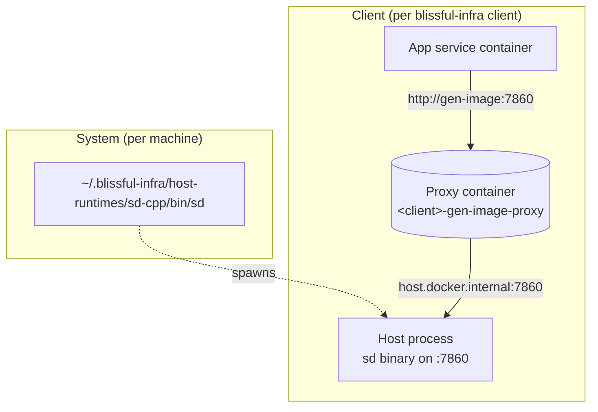

# 0015. Host-mode sidecars for hardware-accelerated plugins

- **Status:** Proposed
- **Date:** 2026-05-05
- **Deciders:** @cavanpage

## Context

Docker Desktop on macOS runs containers in a Linux VM with no path to the host GPU. Apple Metal is invisible from inside that VM. This breaks any workload that depends on hardware acceleration on Mac, and Mac is a substantial share of the indie / studio laptop fleet that blissful-infra targets.

The first concrete victim was image generation ([ADR-0013](./0013-local-image-generation-plugin.md)): stable-diffusion.cpp on CPU is 20–60s per image, with Metal it's 2–5s. The gap is the difference between "creative tool" and "wait around." But the same problem will hit every GGML-family workload the platform ships next:

- `gen.text` via llama.cpp / Ollama (Ollama-in-Docker on Mac is already a known pain; Ollama themselves recommend host install on macOS)
- `gen.audio` via whisper.cpp / bark.cpp
- MLX-based models (Apple-only by design, no container option exists)
- Future USB / Bluetooth / serial-device bridges (hardware passthrough, not GPU)

We need a platform-level pattern for plugins that need direct host access, instead of teaching every plugin to solve the problem independently.

The user feedback that triggered this: *"i like the host mode side car, there are several other things this can probably be used for, at least other models."*

## Decision

Add **host-mode sidecars** as a first-class platform concept. A plugin can declare it supports running as a host-native process; a client can opt to use that mode; the CLI manages installation, lifecycle, and proxying. Three layers, each owning one concern:



### Layer 1: System — the binary cache

Native binaries live at `~/.blissful-infra/host-runtimes/<runtime>/`, installed once per machine, shared by every client that uses them. Same pattern as the model-weight cache from ADR-0013.

```
~/.blissful-infra/host-runtimes/
├── sd-cpp/
│   ├── bin/sd
│   ├── version.txt
│   └── checksum.txt
├── llama-cpp/
│   ├── bin/llama-server
│   └── version.txt
└── whisper-cpp/
    └── ...
```

Install / update via `blissful-infra runtime install <name>`. v1 strategy: download a pinned release for the host OS/arch from the upstream project's GitHub releases, verify SHA-256, drop in cache. Build-from-source path documented but not automated.

**Windows binary choice (v1):** the Windows runtime is a **WSL2-native Linux binary** (e.g. `linux-amd64` build of stable-diffusion.cpp with CUDA), spawned via `wsl.exe`. WSL2 has direct CUDA passthrough on Windows 11, so this gets the user GPU acceleration without requiring a separate native Windows build. Native Windows + CUDA binaries (`win-amd64`) are deferred to a follow-up; users who need them can drop a binary into the cache manually and the CLI will use it. This choice is documented; Windows users who don't want WSL2 stay on container mode by default.

### Layer 2: Plugin — capability declaration

Plugin manifests gain a `runtimes` field listing supported modes:

```yaml
# plugins/gen.image/plugin.yaml
name: gen.image
runtimes: [container, host]
hostRuntime:
  binary: sd-cpp
  port: 7860
```

Container-only plugins omit `runtimes` (defaults to `[container]`). Host-only plugins (e.g., MLX-based) declare `runtimes: [host]`.

### Layer 3: Client — mode selection

Client config picks the mode, with an OS-aware default for the boolean form:

```yaml
infra:
  gen:
    image: true                    # auto: macOS → host, others → container
  # or explicit:
  gen:
    image: { mode: host }
  gen:
    image: { mode: container }
```

Auto-resolution rules for the boolean form (logged at `client up` so the choice is never silent):

| Host | Plugin supports | Default mode |
|---|---|---|
| macOS | host + container | host (Metal) |
| Linux + NVIDIA | host + container | container (Container Toolkit) |
| Linux CPU-only | host + container | container (parity, simpler) |
| Windows | host + container | container (Docker Desktop + WSL2 + CUDA) |
| any | host only | host |
| any | container only | container |

The defaults pick the path of least friction. `{ mode: host }` and `{ mode: container }` are first-class explicit choices on every OS — there is no platform where one mode is forbidden, only platforms where the default is one or the other. Linux/Windows users with working container GPU passthrough can still opt into host-mode for the reasons in the next section.

### When to pick host-mode explicitly on Linux / Windows + NVIDIA

Container mode is the default on these platforms because Container Toolkit / WSL2 GPU passthrough already works. But there are real reasons a user might flip `mode: host`:

| Reason | Why it matters |
|---|---|
| Skip the NVIDIA Container Toolkit install | Toolkit setup is its own pain (driver-version pinning, package conflicts on certain distros). Host-mode bypasses it entirely. |
| Marginal speed gain | No container overhead on the inference hot path. Small but measurable on tight loops. |
| Easier debugging | `gdb` / `nsys` / `nvprof` attaches to a host process directly; through a container it's a fight. |
| Multi-GPU clarity | Host process sees all devices natively; container needs explicit `--gpus device=0,1` mapping per plugin. |
| Windows: avoid Docker-Desktop indirection | Docker Desktop on Windows is a Hyper-V / WSL2 VM running containers; the host-mode binary runs in WSL2 directly, one fewer layer. |

These are explicit user decisions, not defaults. Documented so studios know the option exists; flagged in the dashboard's "infra mode" view.

### Proxy container

When a plugin runs in host mode, the client compose stack still ships a thin `<client>-<plugin>-proxy` container on the infra network. It forwards traffic to `host.docker.internal:<allocated-host-port>`. Service-side env vars don't change between modes:

```
IMAGE_GEN_URL=http://gen-image:7860/v1   # same in either mode
```

This keeps the rest of the platform mode-agnostic. Templates, services, dashboard all see one URL regardless of where the actual work happens. The seam is the proxy container.

### Lifecycle

`client up`:
1. For each plugin in `host` mode, check the system binary is installed; error with an install hint if not.
2. Spawn the host process bound to the client's allocated port (`7860 + blockIndex` for `gen.image`), logging to `~/.blissful-infra/clients/<name>/logs/<plugin>-host.log`.
3. Bring up the proxy container in compose.

`client down`:
1. Stop the proxy container (compose default).
2. Send SIGTERM to the host process, wait, SIGKILL if needed.

PID stored in `~/.blissful-infra/clients/<name>/host-runtimes/<plugin>.pid`. Crashes are logged but not auto-restarted in v1.

### CLI surface

```
blissful-infra runtime list                  # all installable runtimes + status
blissful-infra runtime install <name>        # download + verify, system-wide
blissful-infra runtime uninstall <name>      # clear from cache
blissful-infra runtime status                # which clients have host processes running
blissful-infra runtime logs <client> <plugin>   # tail the host process log
```

### What is intentionally NOT in this ADR

- **Auto-update of installed runtimes.** v1 is manual; re-running `runtime install` picks up the latest pinned release.
- **Build-from-source automation.** Documented for users on bleeding-edge or unsupported arches; not run by the CLI.
- **Sandboxing** (running host process as a separate user, AppArmor/seccomp profiles). Future work; called out in Risks.
- **USB / Bluetooth / serial-device passthrough.** The same pattern would extend, but the binaries and lifecycle differ enough to warrant a separate ADR when the use case lands.
- **Cloud-deploy adapter.** Host-mode is a local concept. Cloud always uses managed services or containers with platform-provided GPU.
- **Sharing one host process across clients.** Rejected in Alternatives; violates per-client isolation.

## Consequences

### Positive

- **Hardware-bound workloads escape container overhead on every OS.** macOS is forced into host-mode for GPU access (no Metal in Docker Desktop); Linux and Windows users can opt in for marginal perf, easier debugging, multi-GPU clarity, or to skip the NVIDIA Container Toolkit install entirely. Same primitive, different motivations per platform.
- **One pattern, many components.** Image gen, text gen, audio gen, MLX models, future hardware bridges all use the same shape — a system-cached binary, a per-client process, a proxy container.
- **Mode-agnostic services.** Spring Boot / React / Lambda code is identical regardless of where the worker runs. The proxy container is the only seam, and service-side env vars don't change between modes.
- **System cache means no per-client disk waste.** A 50MB binary + GB of weights live once per machine, used by N clients.
- **OS-aware defaults are transparent.** Mac users don't have to know what Metal is; Linux users don't get pushed onto host-mode they don't need. Either group can opt out of the default with one config line.
- **Runtime versioning has a clear home.** `runtime install` is the single command that matters, no scattered "go install this thing yourself" docs across each plugin.

### Negative

- **Two failure modes per plugin.** "It's broken" now branches: container, host process, or proxy. Triage path is more complex; needs a documented runbook entry per host-mode plugin.
- **Reduced isolation.** The host process has full access to the user's filesystem and GPU, just like any other native binary they install. Acceptable for `localhost` dev tooling; called out plainly so users understand the trade.
- **Version pinning is a real burden.** Each runtime has its own release cadence (sd-cpp, llama-cpp, whisper-cpp, MLX). Platform owns the pinning policy; bumps require checksum updates and smoke tests.
- **First time the platform manages host processes other than the API server.** Process management (orphans, cleanup on crash, port collisions) moves from "one well-known process" to "N per running client." Requires careful PID tracking.
- **Documentation surface grows.** Each host-mode plugin needs an OS-by-OS install matrix.

### Risks / follow-ups

- **Binary verification.** Downloads MUST be SHA-256-verified. Signature verification (Sigstore, GPG) is the safer path; v1 ships SHA-256-only with signatures as a follow-up.
- **Port collisions across clients.** The existing port-block allocation handles container ports; the same allocation logic must be applied to host-side ports. Test that two running clients with `gen.image` host-mode don't fight for `7860`.
- **Crash recovery.** v1 doesn't auto-restart. If Maya generates 200 posts overnight and the binary crashes at 3am, that's bad UX. Per-plugin opt-in supervisor is the natural follow-up.
- **`gen.text` migration.** The Ollama path under [ADR-0010](./0010-decompose-ai-pipeline-plugin.md) will likely want to move to a host-mode plugin on macOS for the same reason. Sequencing: ship 0015 + 0013, then re-open the gen.text discussion.
- **Stale host processes after a CLI crash.** If `client up` succeeds, then the CLI crashes, the host process keeps running. PID-file reconciliation on next `client status` or `client down` is required.

## Alternatives considered

- **Container-only with future Metal passthrough.** krunkit / libkrun on macOS are the experimental path forward. Rejected: not GA, timeline measured in years, and no help to users today.
- **Per-plugin host-mode, baked in to each plugin.** Each plugin solves it independently. Rejected: every GGML plugin would re-invent install / lifecycle / proxy. Pattern duplication and inconsistent UX.
- **Make users install host binaries manually.** Document upstream URLs, let users download, expose env vars. Rejected: violates the "everything via blissful-infra" UX promise; raises the floor for the indie / student audiences specifically.
- **Run host process per-client, no system cache.** Each client installs its own binary. Rejected: GB-scale waste for users running multiple clients (a real case for studios with `dev` + `demo` + `client-a`).
- **One platform-wide host process shared by all clients.** Lower disk + memory overhead. Rejected: violates per-client isolation ([ADR-0002](./0002-per-client-isolation-model.md)). Different clients should not share state; shared port + shared model + shared logs would couple them.
- **Three separate ADRs (system layer / plugin contract / client config).** Rejected: the layers only make sense together; splitting buries the design under cross-references.

## References

- [ADR-0002](./0002-per-client-isolation-model.md), the isolation boundary host-mode must respect
- [ADR-0010](./0010-decompose-ai-pipeline-plugin.md), `gen.text` / ai-pipeline runtime that may migrate to host-mode on Mac
- [ADR-0013](./0013-local-image-generation-plugin.md), first concrete user of this pattern
- [stable-diffusion.cpp](https://github.com/leejet/stable-diffusion.cpp)
- [llama.cpp](https://github.com/ggerganov/llama.cpp)
- [whisper.cpp](https://github.com/ggerganov/whisper.cpp)
- [Apple MLX](https://github.com/ml-explore/mlx), Apple-only ML framework requiring host runtime
- [krunkit](https://github.com/containers/krunkit), experimental Metal-passthrough VM, the future-state container alternative
