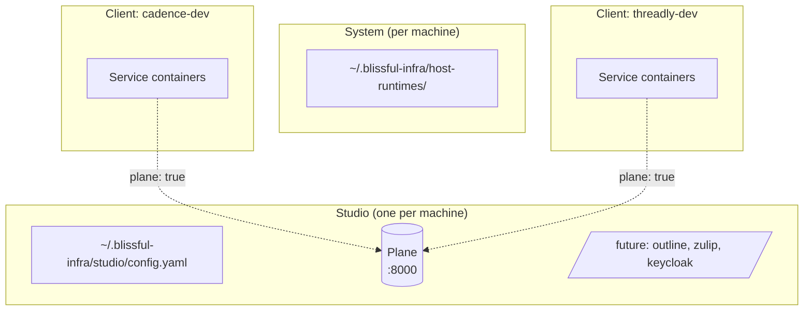

# 0016. Studio-level infrastructure layer with Plane

- **Status:** Proposed
- **Date:** 2026-05-05
- **Deciders:** @cavanpage

## Context

Indie studios using blissful-infra need a ticket tracker for epics, stories, and team work. JIRA and Linear are the obvious commercial options but cost per seat and hold the data on someone else's servers, both of which fight the platform's positioning ([specs/product.md](../../specs/product.md), [target audience memory](../../specs/product.md)). The OSS landscape has solid candidates (Plane, Taiga, OpenProject, Redmine, Huly).

A tracker doesn't fit the per-client isolation model ([ADR-0002](./0002-per-client-isolation-model.md)). A studio has one tracker that spans every client app it works on, the way an agency has one JIRA workspace and many client projects inside it. Forcing the tracker into client-level would either:

1. Create N tracker instances per studio (N × 700 MB on disk, N sets of credentials, no cross-client view), or
2. Co-locate it with one arbitrary client (which client owns the tracker the others use?).

Neither is right. The platform needs a new layer above client-level for things that *belong to the studio*, not to a specific client.

The user feedback that triggered this: *"as a product manager, i want to use a ticket tracking system for the work the team is doing, as well as me to create epics and stories to lay out high level work. ... I think i agree that i only want to manage 1 instance for the studio."*

## Decision

Add a **studio-level infrastructure layer** parallel to client-level, and ship **Plane** as its first inhabitant. Future inhabitants of the studio layer (docs site, chat, studio-wide SSO) follow the same shape but are out of scope here.

Inhabitants are named after the dependency itself (`plane`, not `tracker`), matching the rest of the platform's naming (`postgres`, `keycloak`, `clickhouse`, not `database` / `iam` / `warehouse`). If we ever pick a different planning tool later, that's a config-key migration in a separate ADR — cheap to do once, not worth a speculative abstraction now.



### Layer 1: Studio root

Studio state lives at `~/.blissful-infra/studio/`, created on first `blissful-infra studio init`. One studio per machine.

```
~/.blissful-infra/studio/
├── config.yaml                     # studio name, which inhabitants are installed
├── docker-compose.studio.yaml      # generated, includes installed inhabitants
├── plane/                          # Plane stack (planning + issues)
│   ├── compose.yaml
│   ├── env/
│   └── data/                       # Postgres + Minio volumes
└── logs/
```

Config shape:

```yaml
# ~/.blissful-infra/studio/config.yaml
studio:
  name: threadbare
  plane:
    port: 8000
  # future inhabitants follow the same shape:
  # outline:  { port: 3000 }     # docs
  # zulip:    { port: 8001 }     # chat
  # keycloak: { port: 8081 }     # studio-level SSO
```

### Layer 2: Plane

**Stack:** Plane's standard self-host Compose (web, api, worker, beat-worker, Postgres, Redis, Minio for attachments). Pinned image tag in `studio/plane/compose.yaml`.

**License:** AGPL-3.0. Acceptable for self-host; documented so users redistributing commercially understand the obligation.

**Footprint:** ~700 MB always-on. `blissful-infra studio down` parks it when the studio isn't in active use.

**Auth (v1):** Plane's built-in email/password. Studio admin (the user running `studio init`) is the first account. Future: route through a studio-level Keycloak when SSO lands as a sibling inhabitant.

**Networking:** Plane services join a `blissful_studio` Docker network (Compose project `blissful_studio`). Clients that opt into Plane attach this network as `external: true` in their compose, so service containers can reach `http://plane-web:80` directly without going through host ports.

### Layer 3: Client linkage — workspace-per-client

A blissful-infra client opts into Plane via `plane: true` in its config. This triggers two things at `client create`:

1. **Workspace provisioning.** The CLI calls Plane's REST API to create a workspace named after the client (slug-safe). Studio admin token is stored in `~/.blissful-infra/studio/secrets.json` (chmod 600) and used for these calls.
2. **Network attachment.** The client's generated compose adds `blissful_studio` as an external network on the services that need it. `PLANE_URL=http://plane-web:80` is injected as an env var.

Client config:

```yaml
client:
  name: cadence-dev
plane: true        # default false; true creates / links to workspace "cadence-dev"
```

`client remove` deletes the workspace (with a confirmation prompt — destructive, contains data). `client remove --keep-workspace` preserves the workspace for handoff or archival.

**Why workspace-per-client and not project-per-client in one workspace.** Plane's workspace boundary is the access-control boundary. Members of workspace A cannot see workspace B exists. This is the natural mapping for studios that may want to invite client stakeholders as collaborators on their own workspace without exposing the rest of the book of business. Project-per-client in a single workspace co-mingles members and breaks that story.

### CLI surface

```
blissful-infra studio init                          # one-time, scaffolds ~/.blissful-infra/studio/
blissful-infra studio status                        # shows studio layer state + installed inhabitants
blissful-infra studio up                            # starts all installed inhabitants
blissful-infra studio down                          # parks all inhabitants

blissful-infra studio install plane                 # adds Plane to the studio
blissful-infra studio uninstall plane               # removes (preserves data unless --purge)
blissful-infra studio plane open                    # opens browser to http://localhost:8000
blissful-infra studio plane export <workspace>      # JSON + attachments bundle (offboarding)

# Existing client commands gain Plane awareness:
blissful-infra client create foo --plane            # equivalent to setting plane: true
blissful-infra client remove foo                    # prompts re: Plane workspace if linked
```

### What is intentionally NOT in this ADR

- **Other studio inhabitants** (docs, chat, SSO). Pattern is reserved; concrete inhabitants are separate ADRs as the need lands.
- **Per-client dedicated Plane instances.** Considered (the "give the client a Docker volume on offboarding" story) and rejected: indie studios don't want to manage N Plane instances; workspace export to JSON is the offboarding answer instead.
- **Plane → Jenkins integration** (commit-message ticket linking, build status posted to issues). Real value, but a follow-up. Plane has webhooks; the integration is ~100 lines, not an ADR-shaped decision.
- **Plane → dashboard tab.** Same — natural follow-up, not load-bearing for this ADR.
- **Plane → agentic workflows** ([specs/agentic-workflows.md](../../specs/agentic-workflows.md)). The Feature / Monitor agents would benefit from reading and updating tickets. Out of scope here; having Plane platform-aware is what makes those integrations possible later.
- **Migration path off Plane.** If the studio later picks Taiga or OpenProject, that's a separate ADR with a config-key migration (rename `plane:` → `taiga:`) and a new install path. Not building a provider abstraction now — pay the migration cost once if it ever happens, instead of paying an indirection cost on every read.

## Consequences

### Positive

- **A real PM tool, no SaaS bill.** Epics, stories, cycles, boards, all OSS, all local. Closes the "but where do I track the actual work?" gap for studios using blissful-infra end-to-end.
- **Studio-level layer is reusable.** Docs, chat, studio SSO, design-asset library — same pattern, same lifecycle, same root directory.
- **Workspace-per-client is the right granularity.** Studios isolate client-stakeholder access without standing up extra infrastructure. Same model JIRA / Linear / Asana use.
- **Cross-client visibility for the studio.** Maya and Dev see all workspaces from one login; clients see only theirs.
- **Offboarding has an answer.** `studio plane export <workspace>` produces a portable bundle — clean handoff at end of engagement.
- **Sets up integrations that matter.** Once Plane is platform-aware (not "another Docker container running over there"), Jenkins linking, dashboard surfacing, and agentic workflows reading/updating tickets all become tractable.

### Negative

- **One more always-on stack.** Plane is ~700 MB resident memory across its services. Mitigated by `studio down` for laptops where it's not always wanted.
- **AGPL-3.0 license.** Self-host studios are unaffected; users redistributing modified versions inherit the obligation. Documented in the install output and in this ADR.
- **First introduction of a new layer concept.** Future engineers reading the codebase need to understand three layers (system, studio, client). Mitigated by this ADR being the canonical reference; concept tested first with one inhabitant before adding more.
- **Plane release cadence.** Plane is young and ships frequently. Pinning is mandatory; bumps need a deliberate test pass. Adds maintenance burden the platform takes on.
- **Studio admin token is sensitive.** Stored in `secrets.json` chmod 600. Compromise grants workspace-creation power across all clients. Acceptable for a local-only artifact; document it.

### Risks / follow-ups

- **Workspace-name collisions.** Two clients with the same name across different studios isn't a problem (different machines), but recreating a removed client could collide with a stale workspace if `client remove` didn't clean up. CLI must verify the workspace is gone before re-provisioning, with a clear error if not.
- **Plane API stability.** Workspace creation, member invitation, workspace export — all rely on Plane's REST API. Pin the API version; plan for breakage when bumping Plane.
- **Studio Keycloak as a sibling inhabitant.** When SSO comes, every studio inhabitant should redirect to it. Plane supports OIDC; document the wiring path even if we don't build it now.
- **Stale workspace if Plane is down at `client create`.** If the API call to create the workspace fails, `client create` must either retry, queue, or fail loudly. Failing loudly is the right v1 default; we don't want phantom clients with no workspace.
- **Backup story.** Plane data lives in a Docker volume. Lost if the volume is pruned. Same gap as ClickHouse / Postgres data ([ADR-0008](./0008-clickhouse-as-client-level-warehouse.md) "Risks"). Document; address holistically when the cloud-deploy story for studio infra arrives.

## Alternatives considered

- **Per-client Plane (each client gets its own stack).** Rejected per user direction: indie studios don't want to manage N instances. Workspace export covers the offboarding case that this approach would have served.
- **Studio-level Plane with one workspace, projects-per-client.** Simpler, but co-mingles client-stakeholder access (members of one project can see all other members in the workspace). Workspace-per-client is the right access-control boundary.
- **Pick a different OSS planning tool first.** Taiga (Apache MPL, more scrum-shaped, less polished UX), OpenProject (heavier, JIRA-clone, GPL-3), Redmine (oldest, ugliest, smallest footprint), Huly (newest, all-in-one but unproven). Plane wins on UX-coming-from-Linear, modern stack, active development; AGPL is the only material trade. Decision can be revisited if Plane's velocity stalls or licensing becomes a redistribution problem.
- **Use GitLab CE for planning + repo + CI.** Rejected: blissful-infra already has Jenkins per client; GitLab would duplicate or replace it, much larger refactor than just adding Plane.
- **Skip the platform integration; let users `docker run` Plane themselves.** Rejected: that loses the workspace-per-client provisioning, the dashboard surfacing potential, and the offboarding command. The integration is the value; otherwise the docs would just say "go install Plane."
- **Abstract behind a `tracker` slot with `provider: plane` so other tools could plug in later.** Rejected: speculative indirection costs cognitive load on every read for a swap that may never happen. Naming the dependency directly (`plane:`) matches the rest of the platform; if a swap ever happens, it's a one-time config-key migration in its own ADR.
- **Make the studio layer optional and let single-client users skip it.** Considered. Implicit today: `studio init` is opt-in, you only run it if you want studio-level inhabitants. No need for a flag; keep it implicit.

## References

- [ADR-0002](./0002-per-client-isolation-model.md), per-client isolation — the boundary the studio layer sits *above*
- [ADR-0008](./0008-clickhouse-as-client-level-warehouse.md), client-level shared resources pattern (this ADR is its studio-level cousin)
- [ADR-0009](./0009-keycloak-as-client-level-iam.md), client-level Keycloak — a future studio-level Keycloak would be a sibling inhabitant
- [ADR-0015](./0015-host-mode-sidecars.md), system-level binary cache — the layer below studio
- [specs/agentic-workflows.md](../../specs/agentic-workflows.md), Feature / Monitor agents that would integrate with Plane
- [Plane](https://plane.so) ([repo](https://github.com/makeplane/plane)), the chosen planning + issues tool
- [Plane self-host docs](https://docs.plane.so/self-hosting/overview), reference for the Compose stack
- [AGPL-3.0](https://www.gnu.org/licenses/agpl-3.0.html), Plane's license — relevant for redistribution
