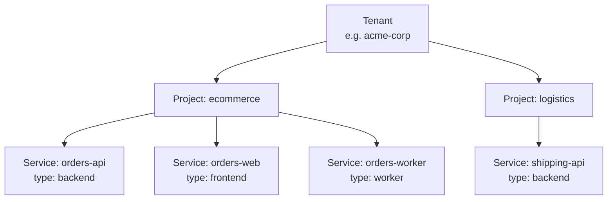

# 0017. Tenant / Project / Service hierarchy with DDD enforcement

- **Status:** Accepted
- **Date:** 2026-05-14
- **Deciders:** @cavanpage

## Context

Until now blissful-infra has used a two-level model: **Client → Service**, where a "service" was a bundled artifact (backend + frontend + optional plugins in one compose project). Real organisations don't work that way. A studio runs many customer apps. An internal platform team owns many domains. A solo dev's "play" environment grows into multiple unrelated projects. The two-level model also muddled vocabulary — the API still called services "projects", the dashboard renamed them "Services", and the docs alternated between both terms.

Beyond clarity, the bigger problem is that the two-level model offers no structural enforcement of Domain-Driven Design. There is no place to express "this kafka topic belongs to the e-commerce domain", no per-service database isolation by default, no project-scoped network. Developers end up building distributed monoliths because the framework gives them nothing better.

## Decision

Adopt a three-level hierarchy that mirrors GCP's Organization → Project → Resource structure and maps cleanly onto DDD:

| Level | Term | DDD concept | Owns |
|---|---|---|---|
| 1 | **Tenant** | Organization | Dashboard, Jenkins, observability stack (Prometheus, Grafana, Tempo, Loki), port block, access roles |
| 2 | **Project** | Domain / Subdomain | Kafka event bus, project-level Postgres, API gateway, isolated Docker network |
| 3 | **Service** | Bounded Context | One process / container. Owns its own DB schema. Communicates externally only via the project's event bus or API gateway |



### DDD enforcement, out of the box

The framework makes the right choice the easy choice:

1. **Service-scoped data**: every new service auto-provisions a dedicated Postgres schema under the project's shared instance. No "shared database" path exists in the scaffolder.
2. **Project-scoped event bus**: each project owns a Kafka broker. Topics are namespaced `<project>.<domain-event>`. Services receive their producer/consumer credentials at scaffold time.
3. **Project-scoped networks**: each project gets its own Docker network. Services within a project can reach each other directly by service name. Cross-project traffic must traverse the API gateway — there is no easy path to share a database or call another project's service directly.
4. **Project-level API gateway**: every project gets an automatically configured gateway (Caddy or similar). Public routes hit the gateway; the gateway routes to internal services. This both isolates the internal topology and gives the project a single ingress point.

### Service shape

A service is exactly one process (one container family). The CLI surface is:

```
blissful-infra service add <tenant> <project> <service> --type {backend|frontend|worker}
```

`--type backend` scaffolds an API service (Spring Boot, lambda-python, etc.). `--type frontend` scaffolds a frontend (react-vite). `--type worker` scaffolds a headless process. A "project" with both an API and a UI is therefore two services, not one. This matches DDD's bounded-context-per-service guidance.

### Access control (designed in, enforcement deferred)

The schemas carry an `owners` and `roles` block at every level. Day-1 implementation is permissive (everything works for the local dev). The slot exists so the eventual access-control story (per-tenant SSO, per-project roles, per-service RBAC) doesn't require another model change.

```yaml
# Tenant level
roles:
  owners: [cavan@acme.com]
  developers: [...]
  marketers: [...]
  viewers: [...]
```

### Naming changes

- **Client → Tenant.** "Client" implied a studio/agency model. "Tenant" scales for freelancers, agencies, enterprise platform teams.
- **service (was: bundle)** → **service** (atomic process). The bundled meaning is replaced by Project ≈ what used to be a service.
- The API path `/api/v1/projects/...` is replaced by tenant-/project-/service-scoped routes documented in the API spec (ADR-followup).

### Directory layout

```
~/.blissful-infra/tenants/
  <tenant>/
    tenant.yaml                       # tenant config: infra flags, port block, roles
    docker-compose.tenant.yaml        # tenant-level: dashboard, jenkins, observability
    projects/
      <project>/
        project.yaml                  # project config: event bus, gateway, postgres
        docker-compose.project.yaml   # project-level: kafka, postgres, gateway, network
        services/
          <service>/
            service.yaml              # service config: type, source paths
            docker-compose.yaml       # service's own compose
            backend/  OR  frontend/  OR  worker/   # source code (exactly one of these)
```

### Port allocation

- **Tenant** gets a base block (e.g. 3010–3019 for the first tenant, 3020–3029 for the second).
- **Project** within a tenant gets a sub-range from its parent (e.g. project 0 → 3010, project 1 → 3013).
- **Service** within a project gets specific ports from its parent's sub-range.

Exact arithmetic is in the new registry util; the principle is hierarchical sub-allocation so port collisions are impossible by construction.

## Consequences

- **Positive:**
  - Clear vocabulary. "Tenant", "Project", "Service" each have one meaning.
  - Matches the GCP/AWS/Azure mental model new users already have.
  - DDD becomes the default, not an aspiration.
  - Per-service DBs and per-project networks force decoupling, preventing distributed monoliths.
  - Access control has a place to live before there's anything to enforce.
  - Scales from solo dev (1 tenant, 1 project, few services) to studio (1 tenant, many projects) to enterprise (many tenants).

- **Negative:**
  - Two-step scaffolding for a basic app: create project, then add services. (The `init` wizard hides this for the common case.)
  - More directories and config files. Trades file count for structural clarity.
  - All existing code that mentions "client" needs to change. Clean break, no migration shim.
  - Per-service DB schemas mean the developer can't trivially share state across services. That is the point, but it is friction.

- **Risks / follow-ups:**
  - The dashboard refactor (three-level sidebar) is the highest-risk phase. Will need its own ADR or design doc if it gets complex.
  - The API gateway choice (Caddy vs Traefik vs nginx) is left open in this ADR. Decided in a follow-up ADR once we know what routing primitives we actually need.
  - Loki labels need to shift to include `tenant`, `project`, `service` so the dashboard logs view scopes correctly.
  - Ontology graph needs to nest by project (sub-groups within the tenant view).

## Alternatives considered

- **Stay two-level, fix naming only.** Rejected because the structural problems (no DB-per-service, no project-scoped network, no place for cross-domain isolation) remain. Renaming alone doesn't solve them.
- **Four levels (Org → Tenant → Project → Service).** Considered for the agency-of-agencies case. Rejected as YAGNI for solo + studio + enterprise — three covers all of them. Re-evaluate if a real customer needs it.
- **Tenant → Service flat (no Project).** Rejected because Project is where domain-level resources (event bus, gateway, network) naturally live. Without it, those resources have nowhere to attach.
- **Keep current model, add "Project" as a tag on services.** Rejected because tags don't enforce anything. The whole point is structural enforcement.

## References

- Gemini research transcript (in commit message of the introducing PR).
- GCP resource hierarchy: https://cloud.google.com/resource-manager/docs/cloud-platform-resource-hierarchy
- Evans, *Domain-Driven Design*, on bounded contexts.
- [ADR-0003: Unified compose project per client](./0003-unified-compose-project-per-client.md) — the two-level structure being replaced.
- [ADR-0008: ClickHouse as client-level warehouse](./0008-clickhouse-as-client-level-warehouse.md) — "client-level" promotion pattern is preserved, now at the tenant level.
