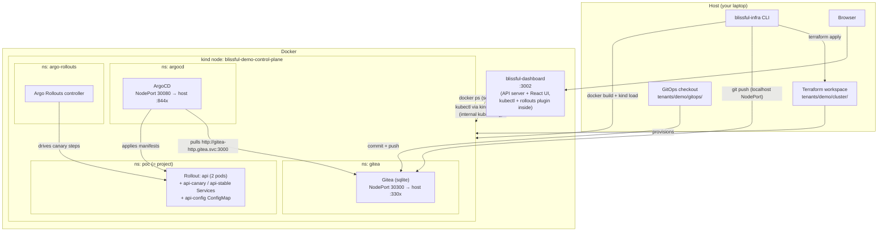

# Demo architecture

What `./demo.sh` (→ `blissful-infra demo`) actually builds, how the pieces
talk to each other, and where everything lives. The **why** behind these
choices is in [ADR-0020](adr/0020-local-kubernetes-runtime.md) (local
Kubernetes runtime) and [ADR-0017](adr/0017-tenant-project-service-hierarchy.md)
(tenant / project / service hierarchy); this page is the **what**.

## The three layers

Everything runs on your machine, in three layers:

1. **Host** — the CLI, Terraform, kind, kubectl. State under `~/.blissful-infra/`.
2. **Docker** — the kind cluster's node (one container) and the host-level
   dashboard container. Both share the `kind` Docker network so the dashboard
   can reach the cluster.
3. **Inside the kind cluster** — the GitOps platform (ArgoCD, Argo Rollouts,
   Gitea) and your workloads, one Kubernetes namespace per project.



## What each piece does

| Piece | Where | Role |
|---|---|---|
| Terraform workspace | `~/.blissful-infra/tenants/demo/cluster/` | Rendered from `templates/cluster/terraform/`; one `apply` creates the kind cluster and helm-installs ArgoCD, Argo Rollouts and Gitea. `terraform destroy` (or `clean`) is the teardown. |
| kind cluster | Docker container `blissful-demo-control-plane` | A full single-node Kubernetes. Its API server publishes on the host (`:655x`); NodePorts 30080/30300 map to the tenant's ArgoCD/Gitea host ports. |
| Gitea | In-cluster, `gitea` namespace | The GitOps origin **and CI engine** (ADR-0023): `blissful-infra ci setup` registers an act_runner, `ci push <service>` mirrors the service source to its own repo and the push triggers a GitHub-Actions-compatible workflow. One repo per tenant (`blissful/demo-gitops`). The CLI pushes to it from the host via the NodePort; ArgoCD pulls it over in-cluster DNS. Dev creds `blissful` / `blissful-dev-pw`. |
| ArgoCD | In-cluster, `argocd` namespace | Watches the Gitea repo, one `Application` per service (`poc-api`), auto-sync with prune + selfHeal. What git says, the cluster becomes. |
| Argo Rollouts | In-cluster, `argo-rollouts` namespace | Replaces Deployments with `Rollout` resources: canary strategy 10 → 25 → 50 → 100 with pauses, promotable/abortable at any step. |
| The service (`api`) | In-cluster, `poc` namespace | A hono (Node/TypeScript) backend from `templates/hono/`. Project = namespace, service = Rollout + canary/stable Services + ConfigMap. |
| Dashboard | Docker container `blissful-dashboard`, host `:3002` | Control plane UI for every tenant. Its AI Chat tab runs `claude -p` in-container and needs its own credentials: `blissful-infra dashboard login` (OAuth) or a host `ANTHROPIC_API_KEY` exported before `dashboard up`. Ships kubectl + the rollouts plugin, joins the `kind` network and uses each cluster's *internal* kubeconfig — that's how a container can see the cluster at all. Also mounts the Docker socket (compose-runtime status) and `~/.blissful-infra` (registry, configs). |

## The deploy flow

`blissful-infra deploy api` (and every rerun of `demo`) is a real GitOps
loop — no `kubectl apply` of workloads from the CLI:

```mermaid
sequenceDiagram
    participant CLI as CLI (host)
    participant D as Docker
    participant G as Gitea (in-cluster)
    participant A as ArgoCD
    participant R as Rollout

    CLI->>D: docker build blissful-demo/poc-api:&lt;tag&gt;
    CLI->>D: kind load docker-image (into the node, no registry)
    CLI->>G: render/bump manifests in gitops checkout, git push
    Note over CLI,G: first deploy also kubectl-applies the ArgoCD Application CR
    CLI->>A: annotate refresh (skip the ~3 min poll)
    A->>G: fetch main
    A->>R: apply manifests (image tag changed)
    CLI->>A: wait until synced revision == pushed sha (or contains it)
    R->>R: canary: 10% → pause → 25% → … → 100%
    Note over R: promote / abort via CLI or dashboard Canary card
```

Key details that make it work locally:

- **No image registry.** `kind load docker-image` copies the image into the
  node; the Rollout uses `imagePullPolicy: IfNotPresent`.
- **Revision-pinned sync wait.** The CLI waits for ArgoCD to sync the *exact*
  commit it pushed (or a descendant, if another deploy landed on top) —
  matching on "Synced" alone races the previous revision.
- **Rollback is a git revert** in the gitops repo. With selfHeal on, that's
  the only rollback that sticks; `rollback --immediate` is the imperative
  escape hatch.
- **First deploy skips the canary** — with no stable revision there's nothing
  to shift traffic from. The canary shows from the second deploy on.

## Ports

Tenant ports are `base + blockIndex` (deterministic, collision-free by
construction). The demo prints the exact URLs; for tenant block *i*:

| Service | Base | Where it terminates |
|---|---|---|
| Dashboard | `3002` (fixed, host-level) | dashboard container |
| ArgoCD UI | `8440 + i` | NodePort 30080 in the kind node |
| Gitea | `3300 + i` | NodePort 30300 in the kind node |
| Kubernetes API | `6550 + i` | kind API server (host loopback) |
| Jenkins / Grafana / Prometheus / Tempo / Loki | `8280+i` / `3030+i` / `9490+i` / `3200+i` / `3100+i` | tenant compose containers (only after `tenant up`; not part of the demo's critical path) |

## State on disk

```
~/.blissful-infra/
├── registry.json                     # tenants, projects, services, port blocks
├── context.json                      # current tenant/project (`use`)
├── docker-compose.dashboard.yaml     # host dashboard compose
└── tenants/demo/
    ├── tenant.yaml
    ├── cluster/                      # terraform workspace + tfstate
    │   ├── *.tf, *-values.yaml
    │   ├── kubeconfig                # host-side (127.0.0.1:655x)
    │   └── kubeconfig-internal       # container-side (node DNS name)
    └── projects/poc/
        ├── project.yaml              # runtime: kubernetes
        └── services/api/             # the hono source you edit
```

The gitops checkout (`tenants/demo/gitops/`) mirrors the Gitea repo:
`projects/<project>/<service>/` holding the kustomization, Rollout, Services,
ConfigMap and the ArgoCD Application.

## Lifecycle

- **`./demo.sh` / `blissful-infra demo`** — idempotent: reuses whatever
  exists, redeploys the service. Rerunning after an edit *is* the canary demo.
- **Drift-safe:** if the cluster was deleted behind Terraform's back (Docker
  purge, `kind delete`), `cluster up` resets the stale state and recreates.
- **`./demo.sh clean`** — deletes the kind cluster, tenant containers,
  registry entry and data dir. `blissful-infra clean --all` removes every
  tenant plus the dashboard.

## Current v1 limits

- Kubernetes-runtime services scaffold **without a database binding** — there
  is no in-cluster Postgres yet, and a DB binding would crashloop on Flyway.
- Canary steps are **pause-based**, not metric-driven — analysis needs
  in-cluster Prometheus. Both are tracked in
  [ADR-0020](adr/0020-local-kubernetes-runtime.md#consequences).
- The Docker VM wants **12GB+ memory**; the platform alone needs ~4GB and the
  demo warns below 10GB (OOM kills look like containers vanishing).
