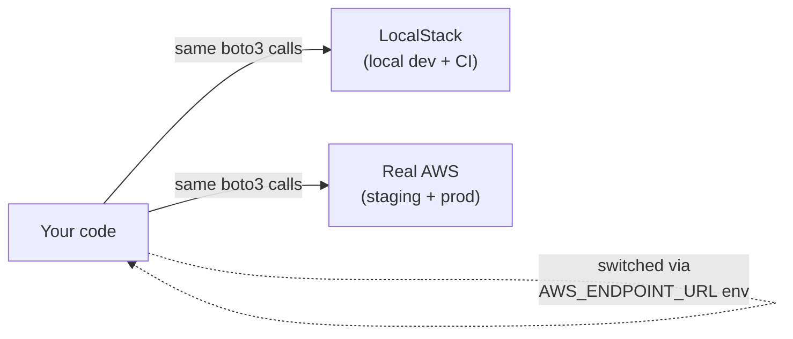

The best way to learn AWS is to use real AWS. There's no substitute for the
real console, real billing alarms, real IAM policies failing closed when you
fat-finger a permission. If you can afford a small monthly spend and you're
willing to set spending alarms, that's where you should start.

But "where you should start" and "where you should live" are different
questions. The free tier covers basic learning for the first 12 months and
then bills you for everything you forgot to tear down. Some services have no
free tier at all. Some experiments need 50 invocations a minute and you'd
rather not watch the meter run while you debug a JSON serialization error
for two hours. And there's a category of work — schema iteration, integration
testing, throwaway prototypes — where the round-trip to the real cloud is
just slow.

That's where [LocalStack](https://localstack.cloud/) earns its place. It
emulates AWS services on your laptop, accurately enough that the same
`boto3` code runs against both. You learn AWS, you keep your wallet closed,
and you keep your iteration loop measured in seconds instead of minutes.

## Why AWS is intimidating when you start

Before getting into the tooling, it's worth being honest about the
beginner experience. AWS is *enormous*. The console homepage lists 200+
services with no obvious ordering, each with its own vocabulary and
pricing model. You don't know what you need yet, but you have to pick
something to click on.

Costs are the harder problem, and they're harder than they should be:

- **No spending warning by default.** AWS will not email you when your
  monthly spend crosses a threshold unless you manually create a Budget
  and configure alerts. The thing that should be on by default — "tell me
  if I'm about to be billed for this" — is opt-in.
- **Cost Explorer is disabled out of the box.** You have to enable it
  before you can even see what you're being charged for at a granular
  level.
- **Region matters for billing**, and the console region selector is in a
  small dropdown in the top right. It's easy to create a bucket in
  `us-east-1`, an EC2 instance in `eu-west-2`, and a Lambda in
  `ap-southeast-1` over a single afternoon of clicking — three different
  bills, three different consoles to find resources in later.
- **Pricing models vary per service.** Lambda is per-invocation +
  per-millisecond + per-GB-second of memory. S3 is per-GB-stored +
  per-request + per-GB-out. RDS is per-hour-of-instance +
  per-GB-of-storage + per-GB-IO. There's no unified "what does this cost
  per day" view until you set one up.
- **The bill arrives weeks later.** Charges from May show up on the
  June 1–15 invoice as cryptic line items grouped by service. By the
  time you see "$47 — EC2 — us-east-1," you've forgotten what experiment
  ran in May.

This isn't a *beginner* problem — experienced engineers get surprise bills
too. But it's worse for beginners because the standard advice ("just
spin up a free tier instance and play around") doesn't mention that
you're one careless `terraform apply` away from a four-figure NAT
Gateway month.

The first thing anyone should do on a fresh AWS account, before
provisioning anything: **set a Billing Budget at $5/month with email
alerts at 50%, 80%, and 100%.** Free tier accidents are common. Without
the alarm, you don't find out until next month.

LocalStack removes this entire anxiety surface for the *experimentation*
phase. The cost is exactly $0 regardless of what you do, the region is
always your laptop, and the only thing you can break is your local Docker
state — which you can rebuild in 30 seconds.

## What LocalStack actually is

LocalStack is a single Docker container that listens on `localhost:4566`
and pretends to be the AWS endpoint for ~70 services. Free tier covers the
basics — S3, Lambda, DynamoDB, SQS, SNS, Kinesis, Step Functions, Secrets
Manager. The Pro tier adds RDS, EKS, IAM enforcement, and a longer list of
specialized services.

You point the AWS SDK at it the same way you'd point at a different region:

```bash
export AWS_ENDPOINT_URL=http://localhost:4566
export AWS_DEFAULT_REGION=us-east-1
export AWS_ACCESS_KEY_ID=test
export AWS_SECRET_ACCESS_KEY=test

aws s3 mb s3://my-bucket
aws s3 cp ./photo.png s3://my-bucket/
```

That's it. No mocks, no abstractions in your application code. The same
production code that calls `s3.put_object(...)` works against LocalStack
locally and real S3 in production.

## What real AWS gets you that LocalStack doesn't

Be honest about this — it matters when you're choosing where to spend your
time:

- **Real IAM enforcement.** LocalStack's free tier doesn't enforce IAM
  policies. Permission bugs that would deny you in production will silently
  succeed locally. The Pro tier turns this on, but for free-tier users it's
  a real gap.
- **Real performance characteristics.** Lambda cold-start times,
  cross-region replication latency, S3 eventual consistency edge cases —
  none of these reproduce locally. If you're optimizing for them, you need
  real AWS.
- **Real billing surprises.** You don't fully understand how a service is
  priced until you've been billed for it. NAT gateway egress, CloudWatch
  Logs ingestion, GB-month for unused EBS volumes — these are the line
  items that surprise people in production. LocalStack will never teach
  you that lesson.
- **Real service quotas and limits.** Lambda concurrency, DynamoDB
  read/write capacity, SQS message retention — production limits and
  throttling behavior are AWS-specific.
- **Multi-region, multi-account scenarios.** LocalStack runs as a single
  endpoint. Real AWS organizations are messier.

If you're learning AWS for a real job — interviewing, architecting at
scale, getting certified — you need real AWS hours. There's no substitute.

## Where the free tier runs out

The 12-month free tier covers a lot at first glance. Then you start
running into the edges:

- **Anything stateful expires.** RDS, ElastiCache, Redshift — all run on
  reserved-capacity pricing. The free tier covers `db.t2.micro` for 12
  months and then you're paying full price. Forgot to delete after the
  experiment? That's $15-30/month per cluster, billed silently.
- **Egress is the silent killer.** Free tier has 100 GB/month outbound,
  which sounds like a lot until you accidentally serve a 200 KB image
  500,000 times from S3 to a CDN you forgot to configure right. Real
  story, more than once.
- **Some services have no free tier at all.** ECS, EKS, RDS Aurora,
  DynamoDB Accelerator (DAX), Glue jobs, EMR — full price from minute one.
- **Free tier is per-account, lifetime.** You can't keep creating new
  accounts to reset the timer (you can, but it's against TOS and AWS will
  catch up).
- **NAT Gateway is the meme.** $0.045/hour to *exist*, plus per-GB data
  processing. ~$32/month per AZ for a NAT Gateway you forgot. Real cost
  of "let me just spin up a quick VPC for this experiment."

Most engineers learn this the hard way — a $200 bill arrives because you
left a project running over the holidays. After that, you tear things down
more aggressively, but you also experiment less. LocalStack short-circuits
that fear.

## Where LocalStack pulls its weight

The work that makes sense locally is the work where iteration matters more
than fidelity:

### 1. Schema iteration

DynamoDB single-table design is a lot of trial and error. You add a GSI,
realize the access pattern doesn't fit, drop it, try again. Doing that
against real DynamoDB is fine — it's pay-per-request — but the round-trip
through `aws dynamodb` commands and AWS console refreshes is slow. Locally
you can rerun a `awslocal dynamodb create-table` script in 200ms.

### 2. Lambda + API Gateway routing

You're writing a Lambda handler. You don't yet know if your event
structure is right, your IAM role is too restrictive, or your response
shape will satisfy API Gateway. Each iteration cycle in real AWS is "zip,
upload, invoke, read CloudWatch logs, fix, repeat" — about 90 seconds per
cycle. Locally, LocalStack's Lambda runs in the same Docker image as real
Lambda, and the cycle is "save file, invoke, read logs" — about 5 seconds.

### 3. Integration tests

You want a CI test that creates a bucket, uploads a file, processes it
through a Lambda, sees the result land in DynamoDB. Doing this in real AWS
needs a test account, IAM teardown logic, and 30 seconds per test for the
provisioning round-trip. Doing this against LocalStack in a CI container
is 2 seconds and uses no real resources. You can run the same test 1000
times a day against LocalStack — try doing that in real AWS without a
budget alarm going off.

### 4. Demo-able local dev

The pitch for blissful-infra and similar tools is "your whole stack runs
on your laptop." If part of your stack is "uploads land in S3, get
processed by Lambda, indexed in DynamoDB," you don't want to require every
developer on the team to have an AWS account configured. LocalStack means
the same `docker compose up` works for everyone, and an offline plane ride
is a productive plane ride.

### 5. Disaster scenario testing

What does your code do when SQS returns 503? When DynamoDB throttles?
When Lambda times out? Real AWS rarely cooperates when you want it to
fail. LocalStack has knobs to inject these failures deterministically — a
much better way to test resilience than waiting for production to surprise
you.

## What good "AWS-aware" local dev looks like

The pattern that actually works for serious work, in our experience:



Three rules that make this stable:

1. **Never have application code that knows about LocalStack.** Your code
   uses the AWS SDK normally; the endpoint is configured at the
   environment level. `AWS_ENDPOINT_URL=http://localstack:4566` for local,
   unset for cloud.
2. **Same IAM model in both.** If your code requires a specific IAM role
   in production, write that role in LocalStack too (Pro) or use the same
   variable names so the Pro upgrade later is friction-free.
3. **Run tests against both periodically.** It's not enough to pass
   against LocalStack and assume the real cloud is fine. A weekly CI run
   against a real (cheap, throwaway) AWS account catches LocalStack-only
   bugs before they hit prod.

This pattern is what blissful-infra's `localstack` plugin embeds — a
LocalStack container alongside your service, init scripts that create
buckets/tables/queues, and environment variables wired so the same code
works locally and in cloud.

## When to upgrade to LocalStack Pro

The free tier is enough for most personal learning and small projects.
Pro becomes worth it when:

- **You need IAM enforcement.** Bugs caught in dev save you from prod
  outages.
- **You need RDS, EKS, or other service-specific emulation.** Free tier
  doesn't include these.
- **You're a team of 3+ and the time savings of one less "works on my
  machine" debug session per week pays for itself.**

For a solo learner, free tier + occasional real-AWS sessions is the right
shape.

## What this means in practice

If you're learning AWS for the first time:

1. **Set up real AWS first.** Get the IAM model in your bones. Click
   around the console. Create a cost alarm at $5/month.
2. **Build one project end-to-end on real AWS.** Watch the bill. Tear it
   down. Watch the bill go to zero. Now you know what costs what.
3. **For the next 10 projects, use LocalStack.** Iterate fast. Write
   integration tests that actually run. Don't worry about leaving things
   on overnight.
4. **Promote a project to real AWS when it has users.** That's when the
   fidelity gap matters.

Real AWS is the best teacher. LocalStack is the best playground. They're
not in competition — they're complementary, and most professional AWS
work that I've seen up close uses both.

If you want a project that ships LocalStack as a first-class plugin
alongside Postgres, Kafka, and Jenkins — wired up so `boto3` just works —
[blissful-infra has it](/getting-started). It's the same pattern, sized
for a laptop.
