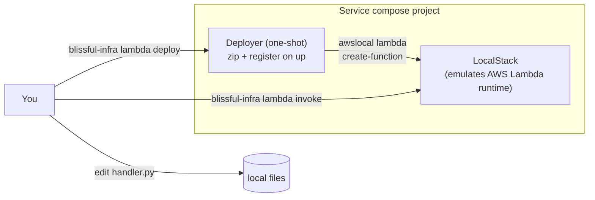

The `lambda-python` backend template scaffolds a single AWS Lambda function
written in Python. It runs in a real AWS Lambda Python runtime container
locally via [LocalStack](/blog/localstack-aws-locally), same image as
production AWS Lambda, so the code that runs locally is the code that runs
in AWS.

## When to pick this template

- You want a serverless on-ramp without committing to a long-running container
- Your service is request-response and small enough to fit a single handler
- You're learning Lambda and want fast local iteration without an AWS bill
- You'd ship to AWS Lambda eventually and want code that's portable from day one

For a long-running HTTP backend, pick `spring-boot` instead.

## Scaffold

```bash
blissful-infra service add <client> <service> --backend lambda-python
# LocalStack is auto-included as the runtime: no need to add it as a plugin.
```

Resulting layout at `~/.blissful-infra/clients/<client>/<service>/`:

```
<service>/
├── blissful-infra.yaml          # service config (type: service, backend: lambda-python)
├── docker-compose.yaml           # generated; localstack + deployer sidecar
├── lambda.yaml                   # function manifest
├── deploy.sh                     # deployer logic (zips + registers with LocalStack)
├── lambda/
│   ├── handler.py                # the entry point: your code
│   └── requirements.txt          # Python dependencies
└── README.md
```

## What runs



On `service up`:

1. LocalStack container starts on the per-service `internal` network
2. Deployer sidecar waits for LocalStack to report ready
3. Deployer reads `lambda.yaml`, zips `lambda/` + deps, calls `awslocal
   lambda create-function`
4. Deployer exits clean. The function is now invocable.

## Manifest reference (`lambda.yaml`)

```yaml
name: hello                       # function name (lowercase alphanumeric + hyphens)
runtime: python3.11               # python3.11 | python3.12 | nodejs20.x | nodejs22.x | java21 | go1.x
handler: handler.lambda_handler   # <module>.<function>
timeout_seconds: 30               # max 900 (15 min, real Lambda limit)
memory_mb: 256                    # 128–10240
environment:
  GREETING: "Hello"               # all values must be strings (real Lambda constraint)
```

Edit any of these and run `blissful-infra lambda deploy <client> <service>`
to apply. Configuration changes redeploy without restarting LocalStack.

## Day-to-day

```bash
# First time
blissful-infra service add <client> <service> --backend lambda-python
blissful-infra service up <client> <service>     # auto-deploys on first up

# Edit handler.py
$EDITOR ~/.blissful-infra/clients/<client>/<service>/lambda/handler.py

# Redeploy
blissful-infra lambda deploy <client> <service>

# Invoke
blissful-infra lambda invoke <client> <service> -p '{"key":"value"}'

# See what got logged
blissful-infra lambda logs <client> <service> --last
```

## Adding dependencies

Add to `lambda/requirements.txt`, then redeploy:

```text
# lambda/requirements.txt
requests==2.31.0
boto3                  # NOT REQUIRED: included in the AWS Lambda runtime
```

The deployer pip-installs into a temp dir and zips alongside your handler
code. Native deps (numpy, pandas, pillow) install with manylinux wheels by
default, matching what real Lambda expects.

## Bigger handlers

The default `handler.py` is a single-function "hello" greeter. For real apps,
structure as you'd write any Python module:

```
lambda/
├── handler.py           # entry: calls into the rest
├── domain/
│   ├── __init__.py
│   └── greeting.py
├── adapters/
│   ├── __init__.py
│   └── ddb.py
└── requirements.txt
```

The deployer zips the whole `lambda/` dir, so anything importable from
`handler.py` ships.

## Cloud deploy

**Not implemented yet.** When the AWS adapter lands, this same `lambda.yaml`
+ `lambda/` will deploy to real AWS Lambda via `blissful-infra deploy
--target aws`. No code changes required.

For now this is a local-only on-ramp. See
[ADR-0007](https://github.com/cavanpage/blissful-infra/blob/main/docs/adr/0007-aws-lambda-local-via-localstack.md)
for the planned cloud-deploy story.

## Limitations vs real Lambda

- **No API Gateway routing locally**: invoke via CLI only
- **No event source mappings auto-wired**: S3/SQS/DDB triggers need manual `awslocal` setup
- **Cold-start times are faster locally** than on real AWS, don't optimize for local timings
- **IAM enforcement is off** in LocalStack free tier, permission bugs that fail in production may pass locally
- **No file-watch auto-redeploy**: manual `lambda deploy` after edits

## See also

- [`blissful-infra lambda` command reference](/commands/lambda)
- [Why LocalStack for AWS local dev](/blog/localstack-aws-locally)
- [`blissful-infra service` reference](/commands/service)
