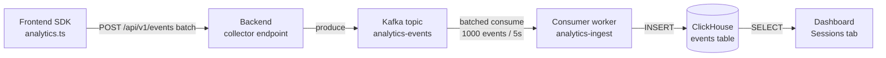

# Blissful Infra — User Session Analytics (ClickHouse)

## Vision

Enterprise-grade product analytics built into the platform: every blissful-infra
client environment ships with a ClickHouse-backed analytics pipeline that
captures user sessions across frontend and backend without per-project setup.
The same primitives that Cloudflare, Discord and Uber use at scale — columnar
TSDB + async Kafka pipeline + JSON-flexible event schema — exposed as a
first-class feature alongside Jenkins and observability.

The goal is not "yet another tracking tool." The goal is that when an engineer
runs `blissful-infra service add ...`, the resulting service emits sessions and
events into ClickHouse from minute one, with a Sessions tab in the dashboard
that shows real user behavior.

---

## Architecture



**Key decisions:**

- **Per-client, not per-service.** One ClickHouse instance per client, all
  services emit to it. Mirrors the rest of the client model (one Kafka, one
  Postgres, one Jenkins).
- **Async pipeline (Kafka in the middle).** Frontend → backend → Kafka →
  consumer → ClickHouse. Never blocks the user on a DB write. Handles bursty
  traffic. Decouples SDK from store.
- **Single events table, JSON properties column.** No per-event schema. New
  event types don't require migrations. ClickHouse's JSON column handles
  flexible properties efficiently.
- **Default on.** When `client create` runs, ClickHouse is enabled and the
  pipeline is wired up automatically. Engineers opt out, not in.

---

## Schema

```sql
CREATE TABLE events (
  ts            DateTime64(3) DEFAULT now64(),
  client_name   LowCardinality(String),
  service_name  LowCardinality(String),
  session_id    String,
  user_id       Nullable(String),
  event_name    LowCardinality(String),
  page_url      Nullable(String),
  referrer      Nullable(String),
  user_agent    Nullable(String),
  ip            Nullable(String),
  trace_id      Nullable(String),     -- correlate with Jaeger
  properties    String                -- JSON-encoded freeform props
)
ENGINE = MergeTree()
PARTITION BY toYYYYMM(ts)
ORDER BY (client_name, service_name, ts, session_id);
```

**Indexes:**
- Primary order: `(client_name, service_name, ts, session_id)` — fast for
  per-client and per-service queries (the common case).
- TTL: keep raw events for 90 days, then aggregate into a `sessions` materialized
  view for long-term storage.

**Materialized views:**
- `sessions_mv` — derived from events, one row per session_id with start_ts,
  end_ts, event_count, page_count, first_page, last_page, user_id.
- `daily_active_users_mv` — count distinct user_id per day.

---

## Component plan

### 1. Backend collector endpoint (Spring Boot template)

`POST /api/events` in the existing service template:

```kotlin
@PostMapping("/events")
fun ingest(@RequestBody batch: EventBatch): ResponseEntity<Void> {
    batch.events.forEach { event ->
        // Enrich server-side
        event.clientName = clientName
        event.serviceName = serviceName
        event.ip = request.remoteAddr
        event.userAgent = request.getHeader("User-Agent")
        event.traceId = MDC.get("traceId")
        kafkaTemplate.send("analytics-events", event)
    }
    return ResponseEntity.accepted().build()
}
```

Lives behind nginx `/api/` proxy. Accepts batches (up to 100 events per
request) so the SDK can buffer client-side.

### 2. Frontend SDK

New file `src/lib/analytics.ts` shipped in the react-vite template:

```typescript
export const analytics = createAnalytics({
  endpoint: '/api/events',
  flushInterval: 5_000,   // batch every 5s
  flushSize: 50,
})

// Auto-tracked
analytics.pageView()       // on route change
analytics.sessionStart()   // on mount, with new or existing session_id
analytics.sessionEnd()     // on tab close (sendBeacon)

// Manual API
analytics.track('button_click', { button: 'subscribe' })
analytics.identify('user_123')   // sets user_id for subsequent events
```

**Session management:**
- `session_id` stored in cookie + localStorage. Generated as UUID v4.
- Rotates after 30 min of inactivity (renew on each event).
- `user_id` is null until `identify()` is called.

### 3. Kafka consumer worker (analytics-ingest service)

New per-client container (sibling to dashboard). Subscribes to
`analytics-events` topic, batches inserts (1000 events / 5s flush), writes to
ClickHouse via HTTP interface (`/?query=INSERT INTO events FORMAT JSONEachRow`).

Implementation: small Node service in `packages/cli/src/server/analytics-ingest.ts`,
or a Kotlin job in the spring-boot template — pick one. Recommend Node since
the dashboard server is already Node and we can colocate.

### 4. Dashboard Sessions tab

New tab in `packages/dashboard/src/App.tsx` driven by new endpoints:

```
GET /api/v1/analytics/sessions?from=&to=          List sessions in window
GET /api/v1/analytics/sessions/:id/events         Event timeline for a session
GET /api/v1/analytics/funnel?steps=...            Funnel conversion chart
GET /api/v1/analytics/top-events?limit=20         Most frequent events
GET /api/v1/analytics/active-users?window=24h     DAU/WAU/MAU
```

API server proxies these to ClickHouse using the official `@clickhouse/client`
npm package.

UI sections (all charts via Recharts):
- **Live ticker** — events/sec across the client (websocket from API server)
- **Sessions per hour** — bar chart, last 24h
- **Top events** — table, sortable
- **Top pages** — table with avg time on page
- **Session detail** — timeline of events for one session_id, linked to Jaeger
  trace via `trace_id`
- **Funnel builder** — pick 2-5 events, see drop-off

---

## Implementation slicing

Build incrementally. Each slice is independently testable.

### Slice A — Plumbing (foundation)
**Goal:** verify the architecture works end-to-end with one curl call.

- Default `clickhouse: true` in `ClientInfrastructureSchema`
- ClickHouse compose entry already exists in [infra-compose.ts](../packages/cli/src/utils/infra-compose.ts) — keep
- Add Kafka topic `analytics-events` to client infra (auto-create on first publish)
- Add `analytics-ingest` consumer container to the client infra compose
- Write the ClickHouse `events` table on container init (init script in `clickhouse/init/`)
- Add `POST /api/events` to the spring-boot template (just publishes to Kafka)
- Verify: `curl -X POST http://localhost:13000/api/events -d '...'` → row appears in ClickHouse

**Done when:** `SELECT * FROM events ORDER BY ts DESC LIMIT 10` shows curl-injected events.

### Slice B — Frontend SDK
**Goal:** real user data flowing without manual curl.

- Create `templates/react-vite/src/lib/analytics.ts`
- Auto-track `page_view`, `session_start`, `session_end`
- Expose `track(event, props)` and `identify(userId)` to React app
- Add 1 example call in `App.tsx`-template so new services demonstrate it
- Documented in the template's README

**Done when:** opening the frontend in a browser produces session and page_view events in ClickHouse without any code changes.

### Slice C — Dashboard Sessions tab
**Goal:** see what your users are doing.

- 5 new `/api/v1/analytics/...` endpoints (see API list above)
- New "Sessions" tab in dashboard
- Live ticker, sessions/hour, top events, top pages, session detail view
- Link `trace_id` from session detail → existing Jaeger UI

**Done when:** loading the frontend, clicking around, then opening the Sessions tab shows your activity in real time.

### Slice D — Backend auto-instrumentation (optional)
**Goal:** backend visibility for free.

- Spring filter in the template that emits `request_started` / `request_completed` events for every API call
- Includes traceId, route, status, latency
- Pairs with frontend events for full user-action → server-trace correlation

**Done when:** every API call shows up in events table tagged with the user's session_id.

---

## Why ClickHouse and not (Postgres, MongoDB, Elasticsearch, etc.)

| | ClickHouse | Postgres | MongoDB | Elasticsearch |
|---|---|---|---|---|
| Columnar | ✓ | ✗ | ✗ | partial |
| Sub-second queries on billions of rows | ✓ | ✗ | ✗ | ✓ (with cost) |
| Cheap at scale | ✓ | ✗ | ✗ | ✗ |
| JSON-flexible properties | ✓ | partial | ✓ | ✓ |
| Used at FAANG scale for analytics | ✓ (Cloudflare, Uber, Discord) | ✗ | ✗ | ✓ |
| Already in our stack | ✓ (existing infra option) | ✓ | ✗ | ✗ |

ClickHouse is the right call. Postgres is already taken for transactional data;
mixing analytics in there ruins both workloads.

---

## Open questions to resolve before building

1. **PII handling.** Default-on analytics in dev is fine (localhost only). For
   the eventual cloud deploy story, need consent banner + data-retention
   controls.
2. **User identification.** Recommend `identify(userId)` is opt-in per
   service — some services don't have user accounts.
3. **Multi-tenant isolation.** ClickHouse is per-client (good). Within a
   client, services share the events table with `service_name` discriminator.
   That's correct for cross-service funnels but means a noisy service can fill
   the partition.
4. **Sampling.** Skip for v1, add later if write throughput becomes a problem.
5. **Schema evolution.** ClickHouse `ALTER TABLE ADD COLUMN` is fast — defer
   migration tooling.
