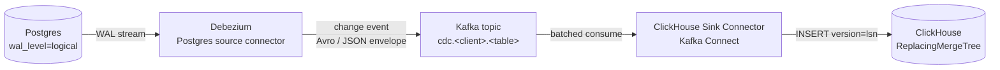

# Blissful Infra. Postgres → ClickHouse CDC Mirror

## Vision

Mirror Postgres tables into the client-level ClickHouse warehouse via change
data capture. No dual-writes from the application, no batch ETL job, no
schema redefinition. A spring-boot service writes to its Postgres tables as
normal, and the same rows show up in ClickHouse in OLAP shape within seconds.

This complements [analytics.md](./analytics.md), which captures
frontend-emitted user events. Two pipelines, same client-level ClickHouse,
disjoint Kafka topic prefixes, disjoint table conventions.

## The pipeline



**Stages:**

- **Postgres** runs with `wal_level=logical` and one replication slot per
  client. Source of truth stays in Postgres.
- **Debezium** tails the WAL, emits a structured change event per row
  insert / update / delete, and hands it to Kafka.
- **Kafka** keeps one topic per source table, named
  `cdc.<client>.<service>.<table>`. Already part of the default infra, so
  no new broker work.
- **ClickHouse Sink Connector** (Kafka Connect) consumes the topic and
  bulk-inserts into the matching ClickHouse table, using the Postgres LSN
  as the row version.
- **ReplacingMergeTree** in ClickHouse resolves duplicates by `version`
  during background merges. Tombstones via `is_deleted` handle Postgres
  deletes.

## How it fits the default-initialized project

```mermaid
flowchart LR
    subgraph client["Client (network: &lt;client&gt;_infra)"]
      subgraph default["Default init"]
        sb[Service: spring-boot<br/>backend]
        pg2[(Postgres<br/>default)]
        kafka2[(Kafka<br/>default)]
        graf[Grafana / Prom / Tempo / Loki]
      end
      subgraph cdc["Added when infrastructure.cdc = true"]
        dbz2[Debezium source<br/>Kafka Connect plugin]
        sink2[ClickHouse sink<br/>Kafka Connect plugin]
        kc[Kafka Connect runtime]
      end
      subgraph warehouse["Added when infrastructure.clickhouse = true"]
        ch2[(ClickHouse warehouse<br/>port 8120+blockIndex)]
      end
      sb -->|writes rows| pg2
      pg2 -->|logical WAL| dbz2
      dbz2 --> kc
      kc -->|cdc.&lt;client&gt;.&lt;table&gt; topic| kafka2
      kafka2 --> sink2
      sink2 --> kc
      kc -->|INSERT| ch2
    end
```

The default `blissful-infra init` already ships the **spring-boot service,
Postgres and Kafka** on the client `infra` network. CDC requires two more
opt-ins:

- `infrastructure.clickhouse: true` so a destination warehouse exists
  (already documented in [warehouse.md](../site/src/content/docs/guides/warehouse.md)
  and [ADR-0008](../docs/adr/0008-clickhouse-as-client-level-warehouse.md)).
- `infrastructure.cdc: true` (proposed) so Kafka Connect, Debezium and the
  ClickHouse Sink Connector get added to `docker-compose.infra.yaml`.

Everything else is already in the default topology.

## ReplacingMergeTree convention

Each mirrored table follows the same shape:

```sql
CREATE TABLE mirror.app.orders
(
    id            UInt64,
    customer_id   UInt64,
    status        LowCardinality(String),
    total_cents   Int64,
    created_at    DateTime64(3),
    updated_at    DateTime64(3),
    version       UInt64,         -- Postgres LSN, monotonic per row
    is_deleted    UInt8           -- 1 on Debezium DELETE event
)
ENGINE = ReplacingMergeTree(version)
ORDER BY (id);
```

Background merges keep the row with the highest `version` per `ORDER BY`
key. `SELECT ... FROM mirror.app.orders FINAL` gives the deduplicated
view for ad hoc queries. Continuous views and dashboards run on top of
a `... FINAL` view or a materialized view that pre-resolves.

## What would need to land

- `infrastructure.cdc: true` flag in the config schema
  ([packages/shared/src/schemas/config.ts](../packages/shared/src/schemas/config.ts)).
- Postgres compose stanza: enable `wal_level=logical`,
  `max_replication_slots`, `max_wal_senders`
  ([packages/cli/src/utils/infra-compose.ts](../packages/cli/src/utils/infra-compose.ts)).
- New `kafka-connect` service in `docker-compose.infra.yaml` using
  Confluent's `cp-kafka-connect` image (or Debezium's image with the
  ClickHouse sink installed).
- Bundled connector plugins: Debezium Postgres source +
  ClickHouse Kafka Connect Sink.
- Init scripts at `~/.blissful-infra/clients/<client>/cdc/init/` to
  register the connectors against the Kafka Connect REST API at startup.
- Service-level opt-in: tables to mirror declared either in the service's
  `data-classification.yaml` (already proposed by
  [ADR-0012](../docs/adr/0012-data-governance-and-dsar-enforcement.md))
  or in a new `cdc:` block in the service config.
- ClickHouse init scripts that create the destination
  `mirror.<service>.<table>` ReplacingMergeTree tables matching the
  source schema.
- CLI affordance (out of scope for this spec):
  `blissful-infra cdc add <client> <service> <table>`.

## Relationship to analytics.md

Both pipelines target the same client-level ClickHouse instance and use the
same Kafka, but they answer different questions and never overlap.

| | This spec (CDC mirror) | [analytics.md](./analytics.md) (event push) |
|---|---|---|
| Source of truth | Postgres row | SDK call from frontend / backend |
| Path into Kafka | Debezium tails WAL | Application produces explicitly |
| Topic prefix | `cdc.<client>.<service>.<table>` | `analytics-events` |
| ClickHouse table | `mirror.<service>.<table>`, ReplacingMergeTree, shape follows source | `events`, MergeTree, single table with JSON properties |
| Latency target | Seconds | Seconds |
| Schema management | One table per source table, evolves with Postgres | One table, JSON props column for new event types |

A query that joins business state with user behavior reads from
`mirror.app.orders` and `events` in the same ClickHouse, with no further
plumbing.

## Related

- [specs/analytics.md](./analytics.md)
- [site/src/content/docs/guides/warehouse.md](../site/src/content/docs/guides/warehouse.md)
- [docs/adr/0008-clickhouse-as-client-level-warehouse.md](../docs/adr/0008-clickhouse-as-client-level-warehouse.md)

A future ADR will formalize the CDC infrastructure and config schema. This
file is the design sketch that ADR will reference.
